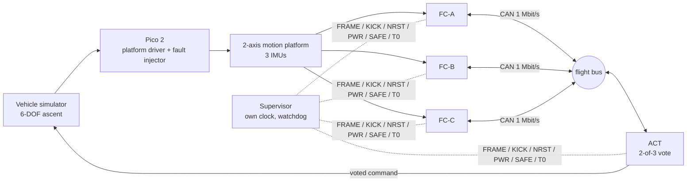

# Triplex Flight Computer

A desk-scale fault-tolerant flight computer: three redundant STM32 flight computers vote through a CAN bus to an actuator node, with real IMUs on a servo motion platform driven by a 6-DOF vehicle simulator. Faults are injected on purpose and measured.


**Status (5 Oct 2026):** everything that can be built and checked without the hardware is built and checked; the parts arrive on 9 Oct 2026 and **nothing has run on a board yet**. [`docs/STATUS.md`](docs/STATUS.md) says what is built, what is proven, and what waits for the hardware; [`docs/LIMITATIONS.md`](docs/LIMITATIONS.md) says what is not claimed.



| Area | State |
|---|---|
| **Flight core** (`core/`, C++17, header-only, no heap, no exceptions): voter, fault manager (3-of-5 and leaky count, probation, strikes, sticky Safe, authenticated commands), sensor/compute split, resynchronisation, releases, phases, estimator, controller, ACT logic | Built. 646 host tests under ASan and UBSan, 100 % line and 98.4 % branch coverage, 390 deliberate bugs all caught ([CODING_STANDARD](docs/verification/CODING_STANDARD.md)) |
| **Supervisor** (`supervisor/`, `firmware/supervisor`): watchdog and reset ladder, boot sequencing, T-zero, the clock of record, the override sense lines | Built (logic and Pico application); not run on a board |
| **Firmware** (Zephyr; `firmware/`: flight computer, actuator node, Pico, supervisor) | Builds for `native_sim`, `nucleo_g474re` and `rpi_pico2`; live tests with real instances on a virtual CAN bus; see [firmware/README.md](firmware/README.md) |
| **Simulator and virtual peers** (`sim/`, `tools/sim`): a 6-DOF model that flies **any vehicle described in a file** (stages, tanks, engines, fins, thrusters, wheels: [VEHICLE_SPEC](docs/design/VEHICLE_SPEC.md), four examples in `vehicles/`), platform model, fake FC-B and FC-C with 32 kinds of fault injection | Built; see [sim/README.md](sim/README.md) |
| **Fault campaign**: every fault kind over its input range, safety properties checked on every frame | 12,362 scenarios, 4.9 million frames, no property violated: [FAULT_CAMPAIGN](docs/verification/FAULT_CAMPAIGN.md), [FMEA](docs/verification/FMEA.md) |
| **Hardware** (the platform, the rig, the supervisor's board, the overrides) | Parts arrive 9 Oct 2026; procedures written: [docs/procedures/](docs/procedures/FIRST_HARDWARE_DAYS.md) |

## Build and test (host)
```bash
cmake -S . -B build -G Ninja -DTFC_SANITIZE=ON
cmake --build build
ctest --test-dir build --output-on-failure
```
The whole list, including the campaign, mutation testing and the live tests, is `docs/STATUS.md` section 7.

## CI
The workflow is `.github/workflows/ci.yml` (runs on pull requests and on `main`): strict build, ASan/UBSan tests, clang-tidy, cppcheck, the coding-standard and coverage gates, the fault campaign (a sample on pull requests), the firmware builds and the live triplex test. `.github/workflows/mutation.yml` runs the mutation checks weekly.

## Contributing
This repo uses GitHub Flow: `main` is always green, all work happens on short-lived branches and lands by squash-merged PR. See [CONTRIBUTING.md](CONTRIBUTING.md).

## Docs
Start at the index: **[docs/README.md](docs/README.md)**. The five-minute reading is [STATUS](docs/STATUS.md), [LIMITATIONS](docs/LIMITATIONS.md), [ARCHITECTURE](docs/design/ARCHITECTURE.md) and [PROOF](docs/project/PROOF.md); the decisions are in [DECISIONS](docs/decisions/DECISIONS.md).

SpaceX-related statements are from public material or inference, not insider knowledge. This is an educational project, not flight-qualified hardware.
