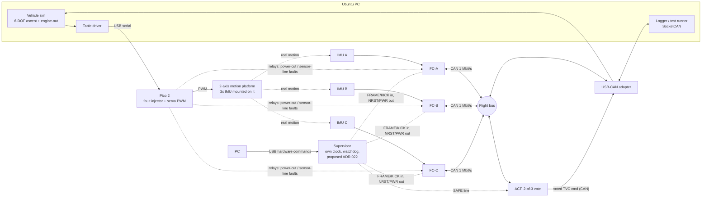

# Architecture (v1 draft)

> Status: design draft. Numbers marked **target** are goals to be measured, not results.
> SpaceX-related statements come from public material and inference. Nothing here is insider knowledge, and this project does not claim to replicate any SpaceX design.

## 1. What is being built

A fault-tolerant flight computer built from three identical flight computers (FC-A/B/C) plus an actuator/voter node (ACT), connected by a classic CAN bus. A PC runs a vehicle simulator. The **flight computers' sensors are real IMUs mounted on a 2-axis servo motion platform** that the simulator drives to the simulated vehicle's attitude (the same idea as an IMU rate table in real hardware-in-the-loop labs). The flight computers estimate attitude from what the IMUs actually feel, compute a thrust-vector command, and ACT votes it and sends it back to the simulator, closing the loop. Faults are injected on purpose and the system must keep the simulated vehicle on its trajectory.



Why this loop: the IMUs feel real motion with real noise, latency and vibration, so the estimator and voter face real data, while the vehicle physics (gravity, thrust, mass loss, wind, engine-out) live in software where they can be repeated exactly. The A/B demonstration is the headline: same scenario with voting on (platform tracks the trajectory through a fault) and voting off (it diverges).

## 2. Nodes

| Node | Hardware | Software |
|---|---|---|
| FC-A/B/C | Nucleo-G474RE + ISM330DHCX (SPI) + CAN transceiver | Zephyr app, C++17: acquisition, consensus, estimator, controller, FDIR |
| ACT | Nucleo-G474RE + CAN transceiver | Zephyr app: command vote, output latch, safe state, watchdog |
| Fault injector | Pico 2 + relay/MOSFET module | Firmware: platform servo PWM, power-cut/sensor-line fault commands |
| Supervisor (proposed, ADR-022) | Pico 2 + TCXO clock module + the spare relay channels | Own firmware, no `core/`: watchdog on every node, resets and power-cycles, independent clock, hardware commands (`docs/SUPERVISOR.md`) |
| Sim host | Ubuntu PC | Python or C++ sim, SocketCAN test runner, log analysis |

All flight-critical logic lives in the portable `core/` library (header-only, no heap, no exceptions, no RTTI) so it runs identically in host tests, in Zephyr `native_sim`, and on the target.

## 3. Frame schedule (time-triggered, 100 Hz major frame)

Time-triggered rather than event-driven so behavior is predictable and jitter is measurable.

| t (ms) | Event | CAN traffic (IDs) |
|---|---|---|
| 0.0 | SYNC from the sync master | `0x010` |
| 0.5 | All FCs latch IMU sample (timer-triggered SPI read) | - |
| 1.5 - 3.0 | Sensor exchange: each FC sends gyro then accel | `0x100+n`, `0x110+n` |
| 3.0 - 5.0 | Consensus, estimator, controller, digest | - |
| 5.0 - 6.5 | Each FC sends its command + estimator digest | `0x200+n` |
| 6.5 - 7.0 | ACT votes, publishes voted output and vote status | `0x300` |
| 7.0 - 10.0 | Heartbeats, sim traffic, slack (**target: at least 25% slack**) | `0x400+n`, `0x500+` (ground commands `0x510`) |

Bus load **target**: about 14 frames per 10 ms, roughly 20% of a 1 Mbit/s classic CAN bus in the worst bit-stuffing case, leaving room for sim traffic.

**SYNC frame.** `0x010`, payload = 32-bit frame number (little endian) | 2 reserved bytes | seq | CRC-8 (`tfc::pack_sync`). The frame number lets late joiners and restarted nodes agree on which frame it is; receivers lock their frame timer to its arrival.

**Clock sync.** Each node runs a free-running frame timer aligned to the hardware RX timestamp of SYNC. The sync master is the lowest-numbered healthy FC; if SYNC is missing for 2 frames the next-lowest healthy FC takes over. This avoids making a single node the time authority.

## 4. Agreement and voting

1. **Input agreement.** Each FC broadcasts its raw IMU sample and receives the other two. Each computes a per-axis mid-value select (median) of the three samples. All healthy FCs that received the same three samples compute the same consensus input.
2. **Deterministic replicas.** Same compiler, same code, same inputs give bit-identical estimator state and command. Each command carries a 16-bit digest of the quantized estimator state.
3. **Cross-check.** Every FC also listens to its peers' commands and digests (peer judging) and flags a peer whose digest or command deviates. The digest exposes silent state divergence before it can reach the actuator.
4. **Actuator vote.** ACT votes the three commands with the same mid-value select and a tolerance, and latches its output. It does not trust FC-side judgments; it flags on its own.
5. **Known caveat.** CAN gives near-atomic broadcast but has a documented inconsistent-omission corner case (a receiver can miss a frame that others got, if the error occurs in the last bits). The digest cross-check is what catches the resulting divergence. This is a good write-up topic.

Missing / late / CRC-bad / out-of-sequence data is treated exactly like a miscompare for that channel.

**Boot order.** Nodes do not boot simultaneously. A peer that has never delivered a good sample is not judged for `startup_grace_frames` (configurable; 500 = 5 s on FC-A, 0 in the host tests). It does not vote and is not counted healthy, so the mode is Simplex until it joins; after the grace period, or at any time once it has been seen, a silent node latches out like any other.

**Frame numbers and phase.** The `seq` byte of every sensor and command frame is the low byte of the number of the SYNC frame that opened the frame's cycle (ADR-018). Each receiver compares it with the number of the frame it is collecting, per node and stream, with a 32-cycle history (`tfc::PhaseTracker`): the current number is on time; an earlier number that was not seen before, and whose own cycle delivered nothing, is a **late frame** (it missed the 7 ms vote: it costs the one `missing` sample, its stale data are judged by the vote and digest, and it is not a sequence error); a number from the future, a repeat, one that is too old, or an earlier number although its cycle already delivered a frame is a **sequence error**. A frame that arrives damaged was still sent and filled its slot; a lost frame simply leaves no trace on the next one, because the next frame carries its own absolute number. A whole burst flushed late by a stalled sender is accepted, each number once. A node that reboots or joins late takes the number from SYNC and is in phase at once. This is what makes a stream that is a whole frame early, late, replayed, duplicated or off by any number of frames visible; a frame that is merely a few milliseconds early inside its own window is not, and needs the arrival-time check deferred in `docs/DEFERRED.md`. Rationale: ADR-007 (the requirement) and ADR-018 (the mechanism).

**Duplex disagreement.** With two voting nodes a disagreement cannot be settled by the vote itself. `RedundancyManager` first tries continuity with the *motion*: it compares both nodes with where the signal should be now (the last agreed value carried forward by the last agreed step) and blames a node only if it is more than 2x the channel tolerance away from that while the other stayed within one tolerance of it; the output then follows the consistent node. (Comparing with the bare last value, as in the first version, blamed the *healthy* node whenever the signal moved more than two tolerances per frame, i.e. whenever the other node had stopped following a moving command: ADR-017.) If continuity does not single one out (a slow drift, a step only just above tolerance, a digest mismatch, a signal that barely moves, no fresh reference) nobody is blamed, the output **holds the last good value**, and if this persists (M of the last N frames, 3-of-5) a **Safe request** is raised that stays raised until an operator clears it (`clear_safe_request()`). A held reference is never used to blame anyone afterwards. Three *different* estimator digests are likewise unresolved: with no majority nobody is isolated. Rationale and the bugs that shaped this rule: ADR-008, ADR-017.

**Out-of-schedule traffic.** The flight-bus schedule fixes which IDs exist. Frames on any other ID are counted, and three or more in one 10 ms frame raise a bus alarm for as long as that continues. CAN carries no sender identity beyond the ID, so a flood cannot be blamed on a node from IDs alone: the response is an alarm (and, in the real system, the actuator node ignoring those IDs), not a latch. ADR-009.

## 5. FDIR (fault detection, isolation, recovery)

- **Detect:** per-channel miscompare, timeout, CRC or sequence error, non-finite value, stuck-at (bit-identical output), digest mismatch, out-of-schedule flood.
- **Persist:** `ChannelMonitor` M-of-N filter (start with 3-of-5) so one glitch does not isolate a healthy channel, OR'd with a leaky `AlphaCount` (+1 per bad frame, x0.9 per good, latch at 3) that catches a node that is bad one frame in three or two in five, which the window never sees (ADR-013).
- **Isolate:** a latched node is excluded from votes starting the same frame and a strike is counted against it.
- **Recover:** latched -> dwell -> probation (a *shadow vote*: the excluded node is compared every frame with the voted output of the healthy nodes) -> readmission, only when an operator asks (default) and only if it keeps agreeing; see the life cycle below and ADR-010. If **no** node is healthy the probationers judge each other (at least two needed, ADR-014), so even a total loss is recoverable without a reset.
- **Protect itself:** configuration validated at construction; node states, the Safe flag and the configuration stored redundantly and scrubbed every frame; an upset is repaired on the safe side and reported (ADR-015).
- **Disable:** the 3rd latch of a node (2nd when the cause is physical, such as a stuck sensor) disables it for the run (a stuck sensor or an intermittent fault counts as physical: the second strike); only a maintenance command brings it back.
- **Degrade:** healthy count 3 -> Triplex, 2 -> Duplex (compare only), 1 -> Simplex, 0 -> Safe. A duplex disagreement is attributed by continuity when that is clear-cut; otherwise the system holds the last voted command and requests Safe (sticky; see section 4).
- **Watchdogs:** independent watchdog per node plus a frame-deadline monitor; a hung node becomes fail-silent, which the others detect as timeouts.

### Node life cycle (ADR-010)

```mermaid
stateDiagram-v2
  [*] --> Healthy
  Healthy --> Latched: 3-of-5 bad frames, or the leaky count (strike +1)
  Healthy --> Disabled: strike limit reached (3; 2 for a physical cause: stuck sensor or intermittent)
  Latched --> Probation: dwell AND operator request\n(dwell 50 frames after a first, transient-looking latch, else 200)\n(or Auto policy: first, transient-looking latch)
  Probation --> Healthy: 100 agreeing frames (300 after a repeat latch)
  Probation --> Latched: one bad or disagreeing frame\n(dwell restarts, no new strike)
  Latched --> Disabled: operator "disable"
  Healthy --> Disabled: operator "disable"
  Disabled --> Latched: maintenance "clear-disabled" (strikes cleared)
```



Total loss (no node Healthy): every `Latched -> Probation` transition may happen for all requested nodes at once, and `Probation -> Healthy` is judged against the cohort's own vote instead of the voted output (ADR-014).

- **Shadow vote.** On probation a node's frames are not part of the vote, but each frame is compared on all 8 channels with the voted output and with the healthy nodes' digest. Frames with no trustworthy reference (nobody healthy, Safe requested, the healthy nodes disagree) neither advance nor fail the probation.
- **One at a time.** Only one node is on probation at once (TTP reintegrates one node per round for the same reason: the voters must not be perturbed by two unproven nodes). The one exception is total loss: when no node is healthy there are no voters to perturb, and the probationers (two or more) are each other's only reference (ADR-014). The first one readmitted becomes the reference for the rest.
- **Operator commands** are CAN ground-command frames (`0x510`, ADR-011, ADR-019): `reintegrate`, `disable`, `clear-disabled`, `clear-safe`. A frame must pass the CRC, a 32-bit SipHash-2-4 tag and a counter window (replays and forgeries are dropped and counted); `clear-disabled` and `clear-safe` always need an ARM frame before the EXECUTE, and a `disable` needs one when it would leave fewer than two healthy nodes (the last voter is reported as critical). Each accepted command is answered with an accepted/refused outcome in the frame report.
- **Not solved:** each flight computer decides alone, so two of them can hold different views of a node; membership agreement (the digest and a heartbeat state exchange) is later work.

## 6. Software layers

```
app (Zephyr threads, ISRs, drivers)     <- board-specific, thin
core/ (portable C++17)                   <- voter, FDIR, protocol, estimator, controller
tests/ (host)                            <- unit + scenario tests, sanitizers, static analysis
sim/  (host)                             <- vehicle model, scenarios, fault campaign runner
```

Rules for `core/`: no dynamic allocation, no exceptions, no RTTI, fixed-size containers, bounded loops, warnings as errors, clang-tidy clean, deterministic floating point (same flags on host and target for the digest-critical path; check `-ffast-math` stays OFF). The full rule set (JPL Power of Ten, NASA-STD-8719.13) with the tool that enforces each is `docs/CODING_STANDARD.md`; the fault-coverage evidence is `docs/FAULT_CAMPAIGN.md`, and the failure-mode analysis behind the fault list is `docs/FMEA.md`.

## 7. Architecture proposals under review (ADR-020 to ADR-023)

Five changes are proposed and documented; none is built. They are decided by the ADRs marked *proposed* until the owner accepts them.

| Topic | Proposal | Where |
|---|---|---|
| Sensing | One IMU per computer, cross-strapped *logically* by the CAN exchange. **Accepted:** separate sensor health from compute health, so a bad IMU does not make its computer useless. **Later stretch:** a ring that re-homes an orphaned IMU to a backup computer (one owner at a time) after a double fault. No simultaneous multi-master IMU wiring | ADR-020 |
| Software diversity | Node C runs the previous known-good release; a disagreement between releases holds the output and asks the operator, because a plain vote would isolate the healthy node | ADR-021 |
| Supervisor | A separate small computer with its own clock and the watchdog the computers cannot give themselves; acts through discrete lines only | ADR-022, `docs/SUPERVISOR.md` |
| Fail-operational scope | Fail-operational through sensing and computing, fail-passive beyond; a second ACT is a stretch | ADR-023 |
| Phases and Safe | HOT, WARM and COLD roles set by the mission phase; Safe is freeze, then null | ADR-023, `docs/MISSION_PHASES.md`, `docs/SAFE_MODE.md` |

**Fail-safe against fail-operational** (the lecture's terms): fail-safe pulls over and waits for help; fail-operational keeps driving because the spare was already turning, and needs a spare already running. The project's first fault is fail-operational (Triplex to Duplex); beyond that it is fail-passive. In the lecture's classification, a mission that asks for a pointing constraint that protects the hardware, an event that cannot be repeated, or crewed flight is the kind that asks for fail-operational; an ascent is one.

**Trades recorded (the lecture's step 2):** ground-commanded against autonomous: everything in FDIR is autonomous except reintegration, clearing Safe and clearing Disabled, which stay with the operator on purpose (ADR-010, ADR-019); redundancy: three computers, hot; processor: one family for the computers, another for the supervisor; point-to-point against bus: a shared CAN bus for the flight data (a babbling node is the known cost, ADR-009), discrete lines for the supervisor; interface throughput and memory sizing: bus load is a target (about 20%) to be re-measured with the added traffic of IF-005, IF-006 and the state records of FDIR-041; code and data sizing on the G474 (512 KB flash, 128 KB RAM per the datasheet figures to be checked) has to hold a golden image and a current one (ADR-021).

## 8. Known limitations (state these in the write-up)

- ACT is a single point of failure in v1. Mitigations: watchdog, the supervisor's reset, and a Safe sequence ACT can run alone (ADR-023). Stretch goal: duplicate ACT with an output selector driven by the supervisor.
- One shared CAN bus is a common-cause failure. Stretch goal: second bus.
- Identical software on all replicas cannot survive a shared software bug. Proposed mitigation: node C runs the previous known-good release (ADR-021), which protects against regressions, not against a bug present in both.
- The motion platform is bandwidth-limited by the servos, so the simulated vehicle is time-scaled to slow rates; the sim must clamp platform rate and travel.
- Classic CAN has no time-triggered guarantee in hardware; determinism is by schedule and measured, not proven.
- Educational scale: this shows the technique, not flight qualification.
