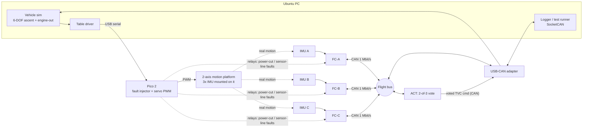

# Architecture (v1 draft)

> Status: design draft. Numbers marked **target** are goals to be measured, not results.
> SpaceX-related statements come from public material and inference. Nothing here is insider knowledge, and this project does not claim to replicate any SpaceX design.

## 1. What is being built

A fault-tolerant flight computer built from three identical flight computers (FC-A/B/C) plus an actuator/voter node (ACT), connected by a classic CAN bus. A PC runs a vehicle simulator. The **flight computers' sensors are real IMUs mounted on a 2-axis servo motion platform** that the simulator drives to the simulated vehicle's attitude (the same idea as an IMU rate table in real hardware-in-the-loop labs). The flight computers estimate attitude from what the IMUs actually feel, compute a thrust-vector command, and ACT votes it and sends it back to the simulator, closing the loop. Faults are injected on purpose and the system must keep the simulated vehicle on its trajectory.



Why this loop: the IMUs feel real motion with real noise, latency and vibration, so the estimator and voter face real data, while the vehicle physics (gravity, thrust, mass loss, wind, engine-out) live in software where they can be repeated exactly. The A/B demonstration is the headline: same scenario with voting on (platform tracks the trajectory through a fault) and voting off (it diverges).

## 2. Nodes

| Node | Hardware | Software |
|---|---|---|
| FC-A/B/C | Nucleo-G474RE + ISM330DHCX (SPI) + CAN transceiver | Zephyr app, C++17: acquisition, consensus, estimator, controller, FDIR |
| ACT | Nucleo-G474RE + CAN transceiver | Zephyr app: command vote, output latch, safe state, watchdog |
| Fault injector | Pico 2 + relay/MOSFET module | Firmware: platform servo PWM, power-cut/sensor-line fault commands |
| Sim host | Ubuntu PC | Python or C++ sim, SocketCAN test runner, log analysis |

All flight-critical logic lives in the portable `core/` library (header-only, no heap, no exceptions, no RTTI) so it runs identically in host tests, in Zephyr `native_sim`, and on the target.

## 3. Frame schedule (time-triggered, 100 Hz major frame)

Time-triggered rather than event-driven so behavior is predictable and jitter is measurable.

| t (ms) | Event | CAN traffic (IDs) |
|---|---|---|
| 0.0 | SYNC from the sync master | `0x010` |
| 0.5 | All FCs latch IMU sample (timer-triggered SPI read) | - |
| 1.5 - 3.0 | Sensor exchange: each FC sends gyro then accel | `0x100+n`, `0x110+n` |
| 3.0 - 5.0 | Consensus, estimator, controller, digest | - |
| 5.0 - 6.5 | Each FC sends its command + estimator digest | `0x200+n` |
| 6.5 - 7.0 | ACT votes, publishes voted output and vote status | `0x300` |
| 7.0 - 10.0 | Heartbeats, sim traffic, slack (**target: at least 25% slack**) | `0x400+n`, `0x500+` |

Bus load **target**: about 14 frames per 10 ms, roughly 20% of a 1 Mbit/s classic CAN bus in the worst bit-stuffing case, leaving room for sim traffic.

**SYNC frame.** `0x010`, payload = 32-bit frame number (little endian) | 2 reserved bytes | seq | CRC-8 (`tfc::pack_sync`). The frame number lets late joiners and restarted nodes agree on which frame it is; receivers lock their frame timer to its arrival.

**Clock sync.** Each node runs a free-running frame timer aligned to the hardware RX timestamp of SYNC. The sync master is the lowest-numbered healthy FC; if SYNC is missing for 2 frames the next-lowest healthy FC takes over. This avoids making a single node the time authority.

## 4. Agreement and voting

1. **Input agreement.** Each FC broadcasts its raw IMU sample and receives the other two. Each computes a per-axis mid-value select (median) of the three samples. All healthy FCs that received the same three samples compute the same consensus input.
2. **Deterministic replicas.** Same compiler, same code, same inputs give bit-identical estimator state and command. Each command carries a 16-bit digest of the quantized estimator state.
3. **Cross-check.** Every FC also listens to its peers' commands and digests (peer judging) and flags a peer whose digest or command deviates. The digest exposes silent state divergence before it can reach the actuator.
4. **Actuator vote.** ACT votes the three commands with the same mid-value select and a tolerance, and latches its output. It does not trust FC-side judgments; it flags on its own.
5. **Known caveat.** CAN gives near-atomic broadcast but has a documented inconsistent-omission corner case (a receiver can miss a frame that others got, if the error occurs in the last bits). The digest cross-check is what catches the resulting divergence. This is a good write-up topic.

Missing / late / CRC-bad / out-of-sequence data is treated exactly like a miscompare for that channel.

**Boot order.** Nodes do not boot simultaneously. A peer that has never delivered a good sample is not judged for `startup_grace_frames` (configurable; 500 = 5 s on FC-A, 0 in the host tests). It does not vote and is not counted healthy, so the mode is Simplex until it joins; after the grace period, or at any time once it has been seen, a silent node latches out like any other.

**Sequence tracking.** Each receiver tracks the expected sequence number per sender and per stream (`tfc::SeqTracker`). A frame that arrives with a bad CRC was still sent, so it consumes a sequence number: one corrupted frame costs exactly one bad sample (the CRC failure), not two (plus a false gap on the next good frame). A real gap, where frames never arrived, is still reported once.

## 5. FDIR (fault detection, isolation, recovery)

- **Detect:** per-channel miscompare, timeout, CRC or sequence error, non-finite value, stuck-at (bit-identical output), digest mismatch.
- **Persist:** `ChannelMonitor` M-of-N filter (start with 3-of-5) so one glitch does not isolate a healthy channel.
- **Isolate:** a latched channel is excluded from votes starting the same frame.
- **Recover:** only by explicit reintegration request followed by a run of clean frames; repeat offenders become permanent (`max_latches`).
- **Degrade:** healthy count 3 -> Triplex, 2 -> Duplex (compare only), 1 -> Simplex, 0 -> Safe. A duplex miscompare cannot be resolved, so the system holds the last voted command, raises an alarm and requests Safe.
- **Watchdogs:** independent watchdog per node plus a frame-deadline monitor; a hung node becomes fail-silent, which the others detect as timeouts.

## 6. Software layers

```
app (Zephyr threads, ISRs, drivers)     <- board-specific, thin
core/ (portable C++17)                   <- voter, FDIR, protocol, estimator, controller
tests/ (host)                            <- unit + scenario tests, sanitizers, static analysis
sim/  (host)                             <- vehicle model, scenarios, fault campaign runner
```

Rules for `core/`: no dynamic allocation, no exceptions, no RTTI, fixed-size containers, bounded loops, warnings as errors, clang-tidy clean, deterministic floating point (same flags on host and target for the digest-critical path; check `-ffast-math` stays OFF).

## 7. Known limitations (state these in the write-up)

- ACT is a single point of failure in v1. Mitigations: watchdog and safe-hold output. Stretch goal: duplicate ACT.
- One shared CAN bus is a common-cause failure. Stretch goal: second bus.
- Identical software on all replicas cannot survive a shared software bug (no design diversity). Discuss, and optionally add a simple diverse monitor.
- The motion platform is bandwidth-limited by the servos, so the simulated vehicle is time-scaled to slow rates; the sim must clamp platform rate and travel.
- Classic CAN has no time-triggered guarantee in hardware; determinism is by schedule and measured, not proven.
- Educational scale: this shows the technique, not flight qualification.
