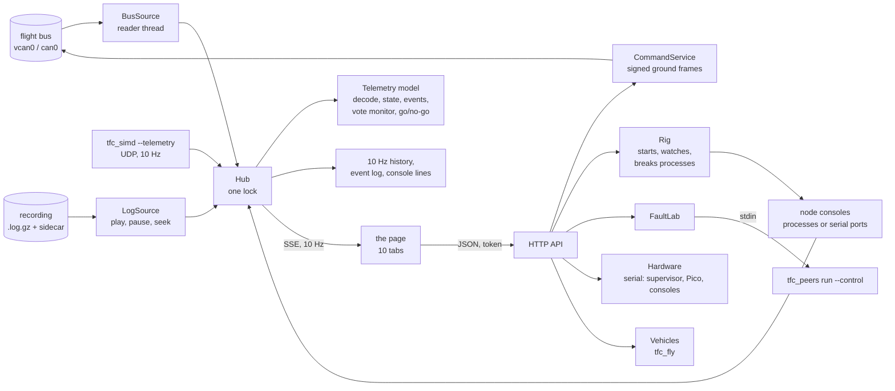
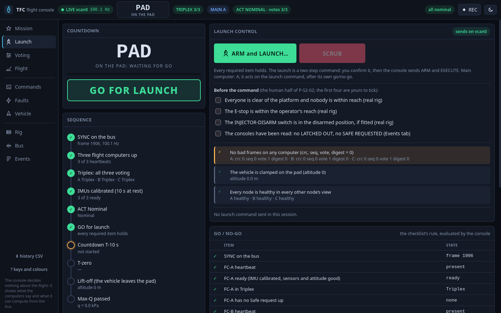
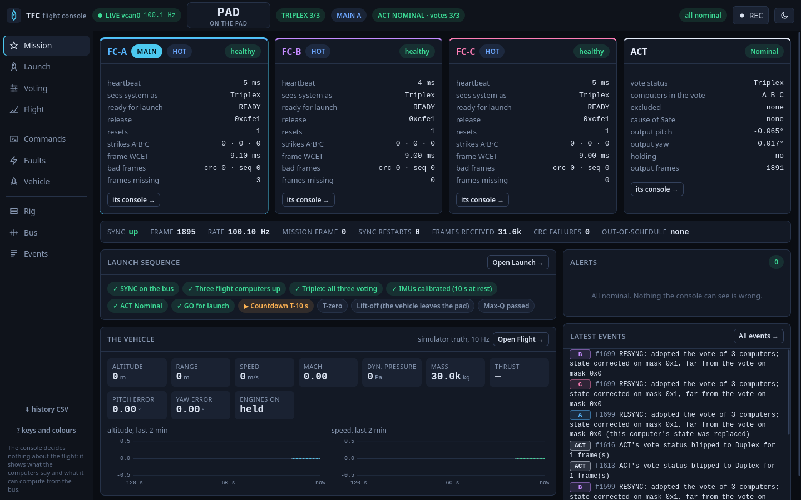
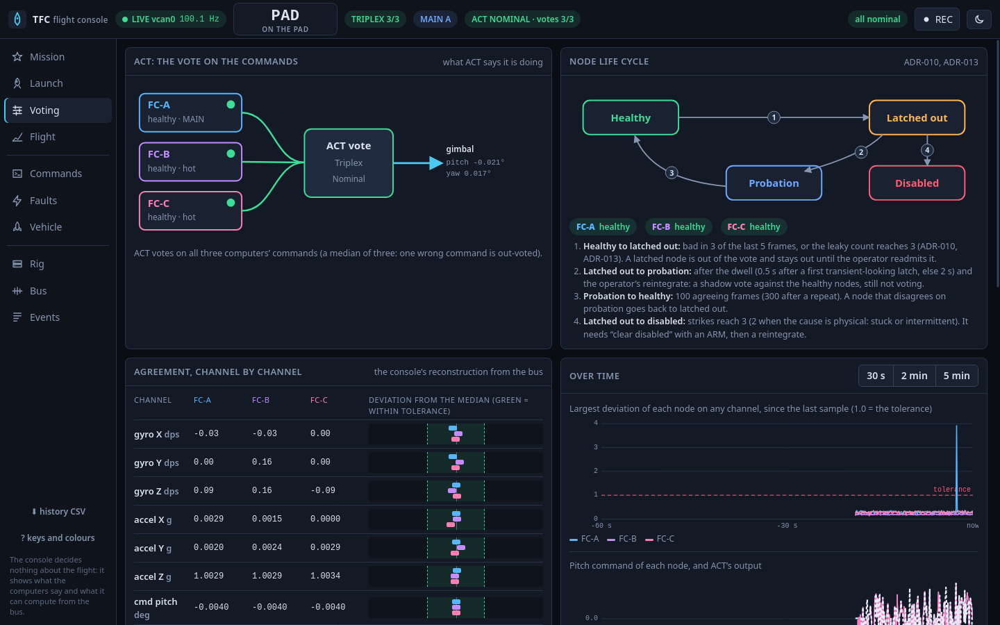
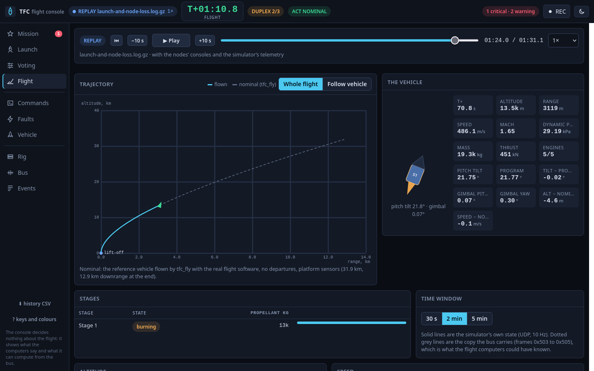

# The flight console: one page to see the system and to command it

> Status: **built** (ADR-034, 8 Oct 2026): `console/` (the server, in Python's standard library), `console/web/` (the page, no libraries), `console/demo/` (one recorded run), the telemetry output of `tfc_simd`, the `range_m` column of `tfc_fly`, and `tfc_peers run --control`. Tested on the host and **live against the real firmware** (three flight-computer processes, ACT and the simulator on `vcan0`); **nothing here has run on a board**: the serial paths (the Nucleos' consoles, the supervisor, the Pico) are tested against pseudo-terminals and a fake Pico only.

## 1. What it is, and what it is not

Until now the system was seen through a dozen terminals: each flight computer's console, `tfc_peers listen`, `tfc_peers launch`, `tfc_peers command`, `tfc_simd`'s log, a CSV for a plot. The console is **one web page** that shows all of it and sends the operator's commands: the countdown and the go/no-go, how the three computers agree (or do not), where the vehicle is, the faults being injected and what the system does about them, and a button for each ground command. It runs on the bench PC, in a browser, and reads the same bus the nodes talk on.

It is an **operator and observer tool, not part of the flight system**. It transmits on the flight bus only authenticated ground commands (the same frames `tfc_peers command` sends, ADR-019); it never sends sensor, command or sync frames; and no flight decision depends on it. If it is closed, killed or wrong, the rig flies on. It is also not a ground station for a real vehicle: the bench key is public (section 11), and nothing in it has been qualified for anything.

## 2. Starting it

```bash
sim/scripts/setup_vcan.sh                 # once per boot (needs sudo)
console/tfc-console                       # attaches to vcan0 and opens the page; the URL carries a session token
console/tfc-console --iface can0          # the USB-CAN adapter, on the bench
console/tfc-console --replay console/demo/launch-and-node-loss.log.gz    # no bus needed: a recorded run
```

Then **Rig** tab, **Start** on "Closed loop with the launch sequence": five processes start (the simulator, three flight computers, ACT), the pad calibration takes about 10 s, the **Launch** tab shows GO, and **ARM and LAUNCH** (a typed confirmation) sends the countdown. `console/README.md` has the flags and the troubleshooting.

## 3. The principles the code keeps

1. **The console decides nothing about the flight.** A node's health (healthy, latched, probation, disabled) is what the flight computers *say* (their heartbeats); the vote status is what ACT says. The console's own arithmetic is labelled as the console's: the deviation of each node from the median, and the go/no-go (which uses the rule of the launch checklist, `tfc_peers/launch.py`, and a test holds the two to the same answer over 400 random states).
2. **Every number has a source, and a silent source is shown as silent.** Nothing is drawn from a stale value without its age; a node that stops sending turns red after 0.5 s, it does not keep its last number.
3. **A reason comes from a console, an outcome from the bus.** The bus carries the fact (a heartbeat changed); only a node's console says why (`node B LATCHED OUT: vote disagreement`) and whether a command was accepted. With no console attached the page says so rather than guessing.
4. **Two-step commands are two steps.** A command that can do harm is sent as an ARM and, 50 ms later, the EXECUTE (what `tfc_peers command --arm` does), only after the page has asked the operator to confirm. The flight computers enforce the rule again; the page's confirmation is the operator's deliberate act, not a substitute.
5. **Test actions say they are test actions.** A fault injected, a process killed, a relay cut is on the event log as `TEST ACTION`, in the operator's name, with what the fault matrix expects.
6. **Standard library only, nothing fetched.** No package to install, no script or font from the network: it runs on a bench with no internet and what it runs is in the repository.
7. **Measured numbers only.** Where the console shows a time (the detection of a fault, the frame rate) it is measured from the bus; where it shows a design figure (a tolerance, the ARM window) it is a copy of a constant of `core/` that a test checks against the header.

## 4. Architecture



* **The model** (`tfc_console/model.py`) is a pure function of the frames and lines it is fed: `feed(t, frame)`, `feed_console(t, src, line)`, `feed_truth(t, dict)`. It keeps the latest of everything, derives events from changes, and builds `snapshot(now)` (the state as one JSON object) and `metrics(now)` (the numbers a chart plots). It is fed with a monotonic clock live and with the log's own clock in a replay, so the same code judges both. 40,000 frames take 0.6 s to decode (about 66,000 frames per second), against a bus that carries about 1,700.
* **The hub** (`hub.py`) is the one place sources deliver to and pages read from: a lock around the model, a ten-minute history of the chart metrics, the event ring, the raw console lines, and the publisher. A page that cannot keep up loses its oldest messages; nothing else waits for it.
* **The page** (`web/`) is plain ES modules and canvas: no framework, no build step, no network. It receives `hello` (the history, the events, the configuration), then `state` ten times a second, `event` and `line` as they happen.
* **The rig's children** are started from one long-lived thread, in their own session, on a pseudo-terminal (so their consoles are line-buffered), and die with the console (`PR_SET_PDEATHSIG`: tested by killing the console with SIGKILL and watching the children go). The console's own server threads run a little behind the rig (`nice` +5): the rig is five processes with 10 ms deadlines.

## 5. Where each number comes from

| Shown | Source | What it can and cannot tell |
|---|---|---|
| Mission clock, countdown, T-zero | SYNC's mission frame (0x010) | Exact: the same frame the computers use. Phase 0 to 7 is not on the bus (it is in a node's status line) |
| Node mode, role, ready, resets, release, view of the others | each node's heartbeat (0x400+n) | The computers' own verdicts. A virtual peer (`tfc_peers`) sends no heartbeat: it is shown as alive from its samples, with no mode |
| Strikes, last command counter | state shares (0x410+n) | 10 Hz |
| ACT's vote status, nodes in the vote, nodes excluded, cause of Safe, output | ACT's frame (0x300) | ACT's own verdict |
| Deviation of each node from the median, per channel, in tolerances | the console, from gyro, accel and command frames of the *same* frame number | A reconstruction. A sample is compared only with samples of the same frame: two samples a frame apart on a signal that moves 10 dps a frame would look 10 tolerances out |
| Why a node was latched, what a command answered, counters, WCET | the node's console (a process of the rig, or a serial port) | Only with a console attached |
| Altitude, speed, mass, dynamic pressure, attitude error, engines | the simulator's frames (0x503 to 0x505), 10 Hz | What the flight computers could have known |
| Range, Mach, thrust, tilt, the program, the gimbal, the stages, the propellant | `tfc_simd --telemetry` (UDP, JSON, 10 Hz) | The simulator's truth, not a sensor. Range is the arc along the surface from the launch point, **inertial** (a rotating planet's own motion is not taken out) |
| The nominal flight (the dashed curve) | `tfc_fly`, the real flight software, no departures | The nominal flight of the vehicle named; it is not what this run was *supposed* to do after a departure |
| Detection time of an injected fault | the console: the frame the computers call the node latched, minus the frame the fault started in | Sampled once per frame by the heartbeat, so it can read one frame late |
| Frame rate | frame numbers over time, per second | Measured: 100.2 Hz on this machine with five native_sim processes |
| Bus load | arithmetic: frames per second times 111 bits | **Not a measurement**: no stuffing, and a virtual bus has no wire |

## 6. The tabs

The four pictures below are the console replaying `console/demo/launch-and-node-loss.log.gz` (section 9), so they can be made again: the Launch tab five seconds before T-zero, the Mission tab 18 s after node B was killed, the Voting tab a little later, and the Flight tab at T+70 s.






**Mission.** The three computers, ACT and the sync at a glance (health, role, ready, heartbeat age, release, resets, strikes, frame time, bad frames), the launch sequence as chips, the vehicle's numbers, the alerts (critical, warning, information; each with its cause), and the latest events. The header always shows the source and the frame rate, the mission clock, the redundancy mode, the main computer, ACT's state, the alert count, and the record button. The redundancy mode is the flight computers' own (the lowest they report) with **the number of sensors still voting**, not of computers powered: a node whose IMU is latched out still sends, so `DUPLEX 2/3` is a node out of the sensor vote. ACT's chip shows how many computers' commands it is voting on (`votes 2/3`).

**The main computer.** There is always one: the lowest-numbered node still sending, A, then B if A is gone, then C (the frame's SYNC comes from the lowest healthy node, by the stagger of `sync_window_us`, `core/include/tfc/sync_clock.hpp`; it also acts on the launch commands). CAN frames carry no sender, so the console *infers* it from who is still sending samples, within 50 ms, and says so (`MAIN B (takeover)` in the header, a `MAIN` badge on the node's card, a warning event when it changes). The nodes' own `takes over as sync master` lines, shown in the event log, are the check: measured live, B took over 2 frames after A was killed and C 2 frames after B, and the console's inference followed within about 10 frames.

**Computers and sensors are voted separately.** The flight computers vote on the three IMUs; ACT votes on the three computers' commands. A latched-out IMU (`IMU B LATCHED OUT (computer B stays in the command vote)`) puts the flight computers in Duplex while ACT still has three commands, so ACT's `Triplex` next to a `DUPLEX 2/3` header is true, and the Voting tab says why in words. With two commands ACT only compares them (it takes their mean when they agree, and on a miscompare holds its last output and blames nobody: it is not a vote); with one it has no cross-check. Flying on in Duplex and Simplex is the design (`docs/design/ACT_LOGIC.md`), and the console does not change it.

**Launch.** The countdown and the GO / NO-GO (large), the sequence as a timeline with the time of each step, the go/no-go as a table (each item of the checklist with its state; the ones that only inform are marked), the pad calibration per computer, the human half of the launch checklist (`docs/procedures/P-S2-02-launch-checklist.md`) as ticks that are the operator's to give, three automatic pre-launch checks, and the two buttons. **ARM and LAUNCH** stays disabled unless the checklist is GO; it opens a dialog that asks for `LAUNCH` to be typed, and sends ARM then EXECUTE. **SCRUB** is one click (the safe direction) during the countdown.

**Voting.** How the agreement works. A diagram of the three computers into ACT's vote (a line is green when ACT took the node's command, dashed red when ACT excluded it); the node life cycle with where each node is now and the rule for each arrow (ADR-010, ADR-013); the eight voted channels with each node's value and its deviation from the median against the voter's tolerance band (a point outside the green band is a sample the voter would call out of tolerance); two charts (the largest deviation of each node against the tolerance, and the nodes' pitch commands with ACT's output); what the computers say about each other (the 3 by 3 matrix of views, the state digests, the strikes, the last counters, the last judgements from the consoles); each node's counters from its status line; and the voter's parameters.

**Flight.** The trajectory (altitude against range; *Whole flight* scales to the nominal flight, *Follow vehicle* to what has been flown) with the nominal flight dashed, the flown trail, marks for lift-off, max-Q and each stage's ignition and separation, and the vehicle; a stage drawing with the propellant left and the engine flame leaning with the gimbal; the numbers, including the difference from the nominal flight at the same flight time; the stages; eight charts (altitude, speed, dynamic pressure, attitude error, ACT's command and the gimbal, pitch tilt against the program, mass, thrust). A dotted grey line is the bus's copy of a number, next to the simulator's own.

**Commands.** One card for each ground command of the protocol (reintegrate, disable, clear-disabled, clear-safe, launch, scrub, phase, no-op, warm) with its target, whether it needs an ARM, and what it does; suggestions from what the computers report (a latched node: reintegrate it, with the reason it must wait; ACT in Safe: what clearing it needs); the command log with each node's answer; and, folded away, the test frames (a forged tag, an ARM alone, an EXECUTE alone, a replay) that show the flight computers refuse them.

**Faults.** The virtual peers' fault lab: any of the 32 fault kinds on B or C with its parameters, an intermittent pattern, a duration, and nine one-click scenarios; the faults now in the scenario, each with its **measured detection**; the processes of the virtual rig (kill, freeze, resume, restart: the live tests' way of breaking a node); and the injector's relays when a Pico is connected.

**Vehicle.** The vehicle list, thirteen parameters ("knobs": thrust, drag, normal force, thrust misalignment, gimbal limit, rate and lag, wind, centre-of-gravity shift, turbulence, the loop's design bandwidth and damping) with their limits and the file's own value, the file as JSON (a raw editor), **Validate** (the simulator's own reader, with line and column), **Fly the preview** (`tfc_fly`: three flight functions and the real ACT logic fly the vehicle from T-zero; plots and the verdict), **Save copy**, and **Use for the rig**. Section 8 says what the rig can fly.

**Rig.** The data source (an interface or a recording, with play, pause, speed and seek in the transport bar), the two rig profiles with their processes, and the serial hardware (the Nucleos' consoles, the supervisor's commands, the Pico's status and relays).

**Bus.** Every id on the bus with its rate against the rate it should have (a 100 Hz id below 90 % is red), count, CRC failures, age and last data (out-of-schedule ids marked; a click on a row filters the monitor to that id), the nodes' CRC and sequence counters, and a live monitor of decoded frames with an id filter and a search.

**Events.** Every event in order, filterable by level and by source (the bus, each node, ACT, the simulator, the operator, the console itself), searchable, expandable to its fields, and saved as JSON; and the raw console of each node. Events of one frame (the same fact seen by the bus, each node and ACT) are grouped into one incident line that opens; in a replay a button on each event replays from one second before it; the list saves as JSON or CSV.

**Everywhere.** A silent node's numbers are dimmed and italic (the last it said, not current); the replay bar has restart, ∓10 s, play, speed and a position slider; *history CSV* downloads the chart history; `?` lists the keys and the colours.

## 7. Commands in detail

A command is the frame `tfc_peers command` would send: id 0x510, an opcode (and the ARM flag), the node field, a SipHash-2-4 tag under the ground key, a counter. The console takes its counter from the **same file** as the command line (`~/.cache/tfc_peers/ground_counter`), so a command typed in a terminal and one clicked in the page never reuse a counter; a flight computer accepts a counter 1 to 32 ahead of the last it accepted, and the first after a restart whatever it is.

| The console | The flight computers |
|---|---|
| Refuses to send unless attached to a live bus; a replay is read-only | |
| An ARM command is sent only when the operator has confirmed it | An EXECUTE without a matching ARM in the last 2.5 s is refused (`needs an ARM frame first`) |
| A launch is refused while its own go/no-go is NO-GO, naming the reasons (`force` sends it anyway, to test the next column) | The sync master refuses a launch that fails its own go/no-go (`LAUNCH REFUSED, no-go: ...`) |
| Logs the command with its counters | Print `GROUND COMMAND reintegrate B: accepted` (or `refused: <why>`); a forged or stale frame is dropped without a trace and only counted |
| Matches each console answer to the command (same opcode, within 7 s) and calls the command accepted, refused, or **no answer** | |

"No answer" is not "refused": with no console attached the page cannot know, and says so. The heartbeats show the effect.

## 8. The rig, the fault lab and the vehicle

**Two profiles.** *Closed loop with the launch sequence*: three real flight-computer processes (the launch images), the actuator node and `tfc_simd --hold` (the vehicle clamped on the pad until T-zero), the system of `docs/procedures/P-S2-02-launch-checklist.md`. *Fault lab*: one real flight-computer process (node A, the scripted-command image), ACT, and **virtual B and C** (`tfc_peers run --follow-sync --control`) whose faults the console changes while they run. (ACT excludes a node it hears nothing from and never readmits it by itself, so in this profile it starts with B and C excluded, because the peers join a second later; the Commands tab suggests the `reintegrate` that readmits them. In the closed loop all five processes start together and nothing is excluded.)

**Why the peers take commands.** Injecting a fault into a running scenario needs the peers' own fault engine (`tfc_peers/faults.py`, exercised by the campaign), which lives in the peers' process; a console that built the faulty traffic itself would duplicate it and put timing-critical frame generation in the web server's process. So `tfc_peers run` got `--control`: one command per line on standard input (`add SPEC [for N]`, `clear ID|all`, `list`, `frame`), one answer line each, applied **between frames**. It is a plain text protocol, so it can be typed by hand, and the console is just a client of it (`tfc_peers/control.py`).

**Measured detection.** When a fault is injected the console records the frame it starts in (the peers answer with it); the first heartbeat in which a computer calls that node latched or disabled, and the first console line `node B LATCHED OUT: <reason>`, give the detection frame, the delay in frames and the reason. The live test injects a 3 dps gyro bias on B and gets **2 frames**, "vote disagreement", as `sim/README.md` says; it does the same for a dropout, a stuck sensor, a command offset and a digest fault (each within the matrix's bound).

**Process faults.** `kill` (SIGKILL: a power cut, the node falls silent at once), `freeze` (SIGSTOP: a hung node that is still powered), `resume`, `restart` (a new boot). They are the virtual rig's counterpart of the injector's relays.

**The vehicle the rig flies.** The flight computers carry the pitch program and the gain schedule of the **reference vehicle**, compiled into the firmware (`firmware/app/src/flight_tables.hpp`). The rig is therefore only right for the reference vehicle, and for plant departures the gains are robust to (the knobs). Another vehicle needs `tfc_gen_tables --vehicle FILE` and a rebuild of the firmware; the page says so before it lets the rig use one. The *preview* flies any vehicle, because `tfc_fly` designs the tables for the vehicle it is given. The knobs are written into a **copy** of the vehicle file, as plain JSON (the `//` comments of the committed examples are not kept); the committed examples are never overwritten.

**Load.** The rig is five processes with 10 ms deadlines on an ordinary desktop. Observed here: with a page open on the Flight tab for 70 s, one ACT vote-status blip of one frame and no latch; but each *start* of a headless browser (a screenshot) several times produced a one-frame stall that made the computers latch one another out (`sequence error`, then a split: A saw Simplex, B and C saw Duplex). That is the computers behaving as designed on a starved host, and the Voting tab shows it plainly; a compile, a browser start or a video call during a run can do the same. The live tests skip when a node was latched before the action (as the older live tests do).

## 9. Recording and replay

**REC** writes `logs/console-<stamp>.log`, the bus as `candump -L` (the format `tfc_peers decode`, `tfc_replay` and `canplayer` read), and `logs/console-<stamp>.side.jsonl`, one JSON object per line for what the bus does not carry: the nodes' console lines, the simulator's telemetry, and what the operator did. Both count time from the start of the recording. A log without a sidecar replays (the bus alone gives the state, the votes and the commands seen on it); a gzip log and sidecar play too.

A replay runs the **same model** on the log's clock. Seeking forgets the model and feeds it again from the start, because the votes, the strikes and the mission clock are histories, not values; a test holds the state after a seek equal to the state of playing straight to that time (frame, phase, health, milestones, the number of events). At the 64 times speed ceiling the 91 s demonstration replays in 2.3 s.

`console/demo/launch-and-node-loss.log.gz` (1.2 MB with its 52 kB sidecar) is a real run of the virtual rig recorded by the console: the last 10 s of the countdown, T-zero, a flight, **node B killed at T+23 s**, the flight on in Duplex to T+78 s. Recorded facts the tests hold the model to: T-zero is 1,000 frames after the countdown began on the bus; the loss of B is called latched by both survivors in the same frame, 2 frames after B's last frame (`F01` in the fault matrix says 2); ACT excludes B and its vote status becomes Duplex; and **max-Q is 31.5 kPa at T+64.9 s, the same as `tfc_fly`'s nominal flight of the reference vehicle** (31.5 kPa at 64.9 s), measured here through three real flight computers, ACT and the simulator.

## 10. The serial path (hardware day)

Each node's console (a Nucleo's ST-LINK virtual COM port, `/dev/ttyACM*`) is read like a rig process's: line by line into the same parser and the same event log. The supervisor takes the commands of `SUPERVISOR.md` section 6 and nothing else (a verb and, for four of them, one of A, B, C, ACT). The Pico is polled twice a second; the console sends only relay cuts (at most 30 s, which end by themselves) and restores, never platform commands: `tfc_simd --pico` streams those, and two writers on one port would interleave frames. All of this is tested against pseudo-terminals and a fake Pico; **none of it has met a board**, and the page says so.

## 11. Security

The console can launch the rig, so it is not an open web page. It listens on `127.0.0.1` unless told otherwise (`--host 0.0.0.0` prints a warning). **Every API request needs the session token** (random, printed in the URL, kept by the page in `sessionStorage` and removed from the address bar); a request whose `Host` is not the address the server started on is refused (DNS rebinding); a POST from another origin is refused; the page carries a content-security policy that allows its own scripts and nothing else; static files are served from their directory only (`%2e%2e` included). Commands are signed with the ground key: **by default the public bench key** from the repository, which is the whole security of the *flight* side on a desk. Set `TFC_GROUND_KEY` (32 hex digits) in the console's and the flight computers' environment before anything that is not a desk (the page says so on the Commands tab; ADR-019, `FUTURE_WORK.md` section 2.4).

## 12. The interface

Every request carries `X-TFC-Token` (or `?token=` for the event stream). Errors are `{"error": "..."}` with a status: 400 a bad request, 401 no token, 403 a bad Host or Origin, 404, 409 "not now, and why", 504 the peers did not answer.

| Endpoint | Does |
|---|---|
| `GET /api/stream` | The event stream: `hello` (history, events, console lines, configuration, vehicles), then `state` (the snapshot and the chart metrics) ten times a second, `event`, `line`, `reset` |
| `GET /api/snapshot`, `/api/history`, `/api/events`, `/api/lines`, `/api/config` | The state, the last seconds of the metrics, the events, the console lines, the constants the page draws from |
| `GET /api/bus`, `/api/frames` | The bus table; decoded frames after a given index, filtered by id |
| `GET /api/source`, `POST /api/source` | What is connected, the interfaces and recordings; attach to an interface, open a recording, disconnect |
| `POST /api/replay`, `POST /api/record` | Play, pause, speed, seek; start and stop a recording |
| `POST /api/command` | Send a ground command (`op`, `target`, `mode`, `confirmed`, `force`) |
| `POST /api/rig/start`, `/api/rig/stop`, `/api/rig/proc` | Start a profile, stop it (or one process), kill, freeze, resume, restart a process |
| `POST /api/faults/add`, `/api/faults/clear` | Add (a spec, and a duration in frames) or clear faults in the peers' scenario |
| `POST /api/hardware/connect`, `/api/hardware/disconnect`, `/api/supervisor`, `/api/pico` | The serial devices, the supervisor's commands, the Pico's relays |
| `GET /api/vehicles`, `/api/vehicle`, `/api/vehicle/nominal`, `/api/job`; `POST /api/vehicle/check`, `/api/vehicle/preview`, `/api/vehicle/save`, `/api/vehicle/active` | The vehicle files, their validation and preview (a job to poll), saving a copy, the rig's vehicle |
| `GET /api/hold` | A development aid: answers after a delay, so that a headless browser's screenshot waits for the first state |

## 13. How it is checked

* **190 tests** in `sim/tests/` (`test_console_*.py`, `test_peers_control.py`, `test_live_console.py`), run with the rest by `python3 -m unittest discover -s tests -t .` (and by `ctest`): the constants against the C++ headers (14); the parser against every format string in the firmware (12); the model (37: the main computer, the go/no-go equal to the launch checklist's verdict over 400 random states, the vote monitor, every event, the silence rules, and the recorded run); the hub, recorder and replay (15: record then replay gives the same events, seek equals straight play); the server (16: token, Host, Origin, traversal, the stream); the commands (21: the frames, the discipline, the answers); the rig with stand-ins for the firmware (14, including a console killed with SIGKILL leaving no child); the fault lab (13); the peers' `--control` (14); the vehicles (17, with the simulator's own reader); the serial devices (11); and **5 live tests** (skipped without `vcan0` and the images) in which the console's own modules start the rig, launch, lose a node in flight, scrub, refuse a launch, inject faults, measure their detection and readmit the node, against the real firmware.
* **In the page**: `?selftest=base` or `?selftest=faults` (`console/web/js/selftest.js`) runs inside a headless Firefox against a live rig: it opens every tab, presses the real buttons, waits for the real firmware's answers, and prints PASS or FAIL. Last run (8 Oct 2026, against the real firmware): **31 of 31** on the closed loop on the pad (every tab renders, the launch dialog asks for `LAUNCH` and lower case does not do, a no-op is accepted by the real firmware, the vehicle validates), **45 of 45** with `?selftest=launch` (the same plus the whole launch through the page: the typed confirmation, the countdown, T-zero, the climb, the Flight tab's charts, then *Kill* on flight computer B in the Faults tab: B latched, ACT excludes it, B silent, a critical alert, the kill named a test action in the event log, then the header read `DUPLEX 2/3` and ACT `votes 2/3` with `MAIN A`, then the trajectory switched to follow the vehicle), and **37 of 37** on the fault lab (a bias injected on B and detected +2 frames, B latched, the system in Duplex, the fault cleared, `reintegrate B` accepted, probation, all three healthy: Triplex restored). `?selftest=layout` reads every tab as laid out and reports content that runs past its box, text cut with an ellipsis and neighbours that overlap; it found the Voting table running into the card beside it, the voter's parameter boxes, the Vehicle tab's knob rows and the Rig tab's process table, and after the fixes every tab and the header are clean at 900, 1100, 1280 and 1920 px wide. A page that imports each module (a syntax error shows at once) found the one typo the first run had.
* **The simulator change** (`Vehicle6::range()`, the `range_m` column, `tfc_simd --telemetry`): a test of the arc against closed forms (the angle times the radius in every direction, a small angle that `acos` would lose, past a quarter of the planet, a coasting orbit), and three mutants (`acos` for `atan2`, no crossrange, an angle for an arc) that the test kills; the C++ suite is 692 tests.

## 14. What it does not do

* **It does not run on a board yet.** The serial paths and the Pico are untested on hardware; the first hardware days (`FIRST_HARDWARE_DAYS.md`) are where they will meet it.
* **It does not replace the procedures.** The launch tab runs the checklist's rule; the human items are the operator's. A recording is an as-run record, not a procedure.
* **The fault lab's peers are not full nodes**: they send gyro, accel and command frames and no heartbeat, so B and C show no mode, role or view in the lab; the real FC-A and ACT do all the judging.
* **The main computer is inferred, not read.** A CAN frame has no sender and the heartbeat does not say who is the sync master, so the console takes the lowest-numbered node that is still sending. It can differ from the nodes' own idea of it for the few frames of a takeover (measured: about 10), and a node that sends samples but whose SYNC is not heard would still be called the main computer; the nodes' `takes over as sync master` lines in the event log are the authority.
* **Range is inertial and the nominal overlay is the reference vehicle's**; a different vehicle's nominal flight is on the Vehicle tab's preview.
* **The page is a single-operator tool.** Several pages can watch at once; two operators clicking commands is possible (counters are serialised) and not designed for.
* **No history beyond ten minutes in the page, and no authentication beyond the token and the ground key.**
* **Headless-browser start-ups disturb the rig** (section 8): this is a property of five real-time processes on a desktop, not of the console.
