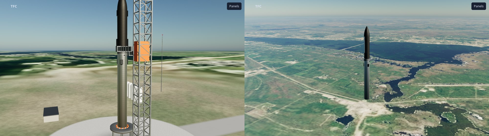

# The 3D viewer: the flight seen as a vehicle, not as numbers

> Status: **built** (ADR-035, 9 Oct 2026): `console/web/viewer/` (the page: WebGL through three.js, vendored), `console/tfc_console/viewer.py` (the data path), `sim/vehicle/viewer_state.hpp` (what the simulator sends), `tfc_simd --viewer`, `tfc_fly --pose`, and a vehicle of the Starship V3 class, `vehicles/starship.json`. Tested on the host (C++: 10 tests, a flight of the vehicle through hot staging and 14 mutants; Python: 39 tests) and **live against the real firmware** (three flight-computer processes, ACT and the simulator on `vcan0`: 50 poses a second, 59 frames a second in the browser). The pictures were looked at in a real browser on a real GPU, which is the only check a picture has; **nothing here has run on a board**, and the GPU cost has been measured on one machine only (section 13).


## 1. What it is, and what it is not

The console ([`CONSOLE.md`](CONSOLE.md)) shows the system as numbers, charts and a SVG rocket. The viewer shows the **vehicle** the simulator is flying: in a sky, over a launch site, with its engines, its stages, its air and its forces, from any side, live or from a recording, in six **lenses** that each look at one process in more detail: *Overview*, *Aerodynamics* (with the centre of pressure and the centre of mass), *Atmosphere*, *Propulsion*, *Loads* and *Attitude*.

It is a **window, not a model**. It decides nothing, sends nothing to the flight bus, and computes nothing the simulator should have computed: every number in a pose is the simulator's own state or one of its own functions (the atmosphere, the wind, the aerodynamics). Where the viewer calculates (a coefficient, a bending moment) it is a formula on those numbers and the lens says so; where it *draws* something the simulator does not model (the air's flow, the exhaust, the ground) it is labelled an illustration. Section 6 is the full list, because the project's rule is that a number says where it came from.

## 2. Starting it

```bash
console/tfc-console                       # the usual: the page opens; "3D viewer" is printed under the address
#  http://127.0.0.1:8765/viewer/?token=...     the viewer, in a window of its own (a second monitor)
console/tfc-console --viewer console/demo/starship-ascent.pose.jsonl.gz   # a recorded flight of the Starship-class vehicle: no bus, no rig
build/host/tfc_fly vehicles/starship.json --sensors vehicle --no-accel --pad 1500 --pose flight.pose.jsonl   # make your own
```

In the viewer, the chip at the top left says where the data comes from; click it to **open a recorded flight**, to **fly any vehicle in `vehicles/`** with the real flight software (it runs `tfc_fly` and plays the result: no flight computer process, a software run of the flight function). To see the **real flight computers** fly a vehicle, choose it on the Launch tab (*Vehicle on the rig*): the console builds the three computers with that vehicle's tables (about half a minute), the rig starts, and the viewer follows the launch live (ADR-036, `CONSOLE.md` section 8), or to see where a live simulator sends. Keys: `1`–`6` the lenses, `C` the next camera, `Space` play and pause, `H` hide the panels, `F` full screen, `P` a picture.

With the rig running (**Rig** tab of the console, *Closed loop with the launch sequence*), the console starts `tfc_simd` with `--viewer PORT` itself and the viewer shows the launch as it happens.

## 3. Why a page of its own, on the same server

The question was whether the viewer should share the console's page or be a different local server. **A separate page on the same server, in its own browser window.** The cost of a 3D view is the browser's main thread and the GPU, not the server's: a separate window is a separate browser process, so the console's charts and the viewer's frames do not take turns, and the rig (five processes with 10 ms deadlines, which a loaded host disturbs) is not asked for more than a pose stream a page may or may not listen to. A second *server* process would have to receive the same UDP telemetry (the port can be bound once), keep a second copy of the state and the token, and be one more thing to start; it would buy nothing the window does not. The viewer has its own event stream (`/api/pose-stream`): a console with no viewer open pays nothing for it (a pose is parsed and kept as the latest, and dropped).

```
 tfc_simd --viewer PORT  --UDP 50 Hz-->  PoseSource  --> ViewerHub --SSE /api/pose-stream--> viewer page (WebGL)
 tfc_fly --pose FILE   --file-->  PoseReplay (play, pause, seek, speed) -->   ^                  |
 a console recording (sidecar k:pose) --> LogSource (the bus replay) --------+                    +-- also /api/stream: the console's own state (nodes, ACT, mission clock)
```

## 4. What the simulator sends

`sim/vehicle/viewer_state.hpp` writes two kinds of one-line JSON; `tfc_simd --viewer PORT [--viewer-hz N]` sends them as UDP datagrams (a **pose** 50 times a second, the **spec** once at the start and every two seconds, because a datagram nobody listened to is lost); `tfc_fly --pose FILE [--pose-hz N]` writes them to a file (spec first). Both are output only: nothing the flight depends on reads them.

**The spec** (`k: spec`): the vehicle as the simulator reads it (the same normalised JSON `tfc_fly --dump` writes: stages, tanks, the engines with the rings expanded, so that an index in a pose is an index in this list, payloads, fins, the scenario), the planet's radius, mu, rotation and pole, and the **air by altitude** every kilometre to 120 km as the model gives it (temperature, pressure, density, speed of sound, mean wind): the viewer draws the atmosphere the vehicle flew through, dispersions included.

**A pose** (`k: pose`), in the inertial frame (+X up at the launch point at T-zero, +Y downrange, +Z crossrange; the body frame has +X along the axis to the nose):

| Key | Meaning | Source |
|---|---|---|
| `t`, `tt`, `fr` | flight time (negative on the pad), the vehicle's own time, the frame | the runner |
| `r`, `v`, `q`, `w` | position (m, from the planet's centre), velocity, attitude (w, x, y, z: body to inertial), body rates (rad/s) | `Vehicle6::state()` |
| `alt`, `rng`, `spd`, `mach`, `qd`, `alpha` | altitude, arc downrange, speed, Mach, dynamic pressure, total angle of attack (deg) | `Vehicle6`, `Loads` |
| `vair`, `wind`, `air` | velocity through the air in the body frame, the wind (inertial), [T, p, rho, a] here | `wind_at`, `atmosphere` |
| `m`, `cg`, `cp`, `cna`, `ca`, `dref` | mass, centre of mass and centre of pressure (m from the tail), the normal-force slope, the axial coefficient, the reference diameter | `mass_props`, `aero_summary` |
| `fth`, `fae`, `mth`, `mae`, `thr`, `mdot` | thrust and aerodynamic force and moment about the CG (body frame), total thrust, mass flow | `Loads` |
| `eng`, `gim`, `fin` | thrust fraction of each engine (-1: failed), gimbal pitch and yaw of each stage, fin deflections | `engine_fraction`, `stage_gimbal_*`, `fin_*` |
| `prop`, `tank` | propellant per stage and the liquid in each tank (kg) | `propellant`, `tank_liquid_kg` |
| `stg`, `ign`, `pay`, `gnd`, `clamp`, `crash` | bits of the stages on, ignited, payloads on; on the ground, clamped, destroyed | the model |
| `tilt`, `ref`, `cmd`, `act` | the two tilts, the program's tilts, ACT's command, ACT's mode | `tilts`, the flight tables, the runner |
| `slosh`, `flex` | slosh displacements and the bending mode, when the vehicle has them | the state |

The C++ tests (`tests/test_viewer_state.cpp`) hold the pose to the vehicle: the position is a planet radius plus the altitude, the quaternion is a unit one in (w, x, y, z) order, the air velocity has the wind taken out, the tanks add up to their stage's propellant, the gimbals are the stages' (pitch then yaw), a failed engine is -1, a separated stage's tanks read empty and its engines read off, and the first line is the spec of the vehicle it describes. Fourteen mutants of the export and of the accessors it uses (`tools/mutation/sim_mutations.py`) are killed.

## 5. Frames, time, and the two scenes

**Axes.** The scene's are Y up, X right, Z toward the viewer; the simulator's are X up, Y downrange, Z crossrange. The map is the cyclic permutation `scene = (sim.Z, sim.X, sim.Y)` (determinant +1, no mirror image), applied to vectors and to the vector part of quaternions, and to the vehicle's body axes (the model's Y is the vehicle's axis).

**Time.** The page keeps a clock that advances in real time at the source's speed and is pulled gently to just behind the newest pose (0.1 s); poses between are interpolated (a cubic through both positions and velocities, a slerp for the attitude, a line for the rest), so a late datagram never shows as a jump. A seek in a recording resets the page and shows the pose it landed on.

**Two scenes, because the numbers do not fit in one.** A planet is 6,371 km across and a vehicle is 9 m. In one scene with one depth buffer, 32-bit floats cannot put a bolt and a horizon in the same frame. So the sky, the atmosphere and the planet are one fragment shader that works from the camera's place above the planet's centre (in kilometres), and everything near is drawn after it, in a scene whose origin is the vehicle's centre of gravity, in metres, with a depth buffer of its own: what is within a kilometre of the camera has millimetre precision (the transforms are done in JavaScript's doubles and only the small offsets reach the GPU).

**The sky** is single scattering by Rayleigh and Mie particles with exponential density (scale heights 8 and 1.2 km): the blue sky, the red sunset, the white glow round the sun and the thin bright limb seen from orbit come out of it, and its thickness follows the simulator's planet. The planet's surface is **procedural** (a coast at the launch point, the sea downrange, land behind, drifting clouds, ice, lights on the night side): it is not a map of anywhere unless an imagery pack is present (section 12). The vehicle is lit by the sun (its colour is the atmosphere's transmittance along the sun's path) and by the sky itself, which is rendered into a small cube at the vehicle's place a few times a second and filtered for its reflections and ambient light, so a steel tank reflects the real sky, the real ground or the black of space.

## 6. What is measured, derived and illustrative

| Lens | Measured (the simulator's own) | Derived (a formula on it; the lens says which) | Illustrative (a picture, not a result) |
|---|---|---|---|
| **Overview** | altitude, speed, Mach, q, mass, thrust, the stages' propellant, the engines running, the events | acceleration in g, thrust-to-weight, vertical speed | the sky, the ground, the launch site and its tower, the exhaust trail, the pad's dust, a stage that has been let go (carried on by the viewer; the simulator does not track it) |
| **Aerodynamics** | Mach, angle of attack, the air, the forces and moments, the centre of mass, the centre of pressure | C_N, C_A, C_D, C_L, L/D, Reynolds number, stagnation temperature, Sutton-Graves nose heating (an assumed 0.5 m nose radius), the static margin | the pressure on the skin (modified Newtonian: Cp_max cos² of the angle to the wind, Cp_max from Rayleigh's pitot formula: a hypersonic method, qualitative below Mach 3), the streamlines (slender-body potential flow from the vehicle's own radius profile), the bow shock (the Taylor-Maccoll cone shock of the nose's angle, tilted with the angle of attack), the Prandtl-Glauert cloud (humidity assumed) |
| **Atmosphere** | pressure, density, temperature, speed of sound, the mean wind (the model's own, every km) | viscosity (Sutherland), mean free path, Knudsen number, scale height, the deviation from the 1976 standard | the shells in the sky and the colours of the bands |
| **Propulsion** | every engine's thrust fraction, the propellant in every tank, the mass flow, the gimbal | effective specific impulse, pressure loss, burn time left, delta-v left (Tsiolkovsky with the effective Isp) | the colour of the liquid, a tank drawn as a cylinder (the simulator's model of it), how far a plume spreads (the nozzle's exit pressure is not modelled: 70 kPa for a sea-level bell and 15 kPa for a vacuum one are assumed) |
| **Loads** | q, angle of attack, forces and moments, masses, where they are | the compression, shear and bending moment at 160 stations: a lumped-mass estimate (the mass spread along each stage and in each tank at its level, every piece accelerating as a rigid body, the aerodynamic normal force at the centre of pressure and the drag along the length): **not a structural analysis**, and there is no allowable | the curve drawn beside the vehicle |
| **Attitude** | the tilts, the rates, the program, the gimbals, ACT's command and mode, and (from the console) the nodes' health and ACT's vote | the error as an angle between two axes | the wire ghost of the vehicle at the program's attitude |

## 7. The vehicle's model

A vehicle is drawn from its **vehicle file** as the simulator read it: the diameters and the nose of every stage, the engines where the engine list puts them, the tanks. A generated model has three styles: *painted* (any vehicle), *Starship* and *plain*. **Starship** is a stainless 9 m stack: weld rings, a booster with its hot-stage ring and vents, three grid fins (Block 3; four for Block 2, and any number from the panel) stowed against the skin and two catch pins, an engine skirt and a thrust plate; a ship with heat-shield tiles on the belly and the nose, two forward and two aft flaps stowed, and its engines (three sea-level, three vacuum, which have larger bells). Its proportions are the class's, public figures, not drawings, and **no markings are drawn**.

`vehicles/starship.json` is a vehicle of the **Starship V3 (Block 3) class** for it to be. It is built from **publicly reported numbers and my estimates, and is not SpaceX data**, not a model of any flight article, and nothing in the project's claims depends on it: it exists so that the simulator and the viewer have a vehicle of that class to fly. Where each number comes from (searched 9 Oct 2026; the sources disagree in places, and the column says which choice was made):

| Quantity | Value in the file | Origin |
|---|---|---|
| Stack, booster, ship | 124.4 m = 72.3 m + 52.1 m, 9 m diameter | reported (Block 3: 124.4 m, Super Heavy 72.3 m; the ship about 52-53 m) |
| Engines | 33 Raptor 3 on the booster (13 gimballed: the inner three and the ring of ten; the outer 20 fixed), six on the ship (three sea-level, three vacuum) | reported (the gimbal split is the Raptor 2 arrangement, assumed to carry over) |
| Raptor 3 thrust, sea level | 2.746 MN (280 tf) | reported (one source says SpaceX's own page still lists 250 tf) |
| Raptor 3 Isp | 366 s in vacuum, which gives 349 s at sea level at the file's nozzle (reported 350 s) | derived from the reported sea-level figure |
| Vacuum Raptor 3 | 3.10 MN, 380 s, exit area 4.5 m² | **my estimate**: Raptor 2 vacuum's 2.55 MN scaled by 280/230 |
| Propellant | 3,400 t in the booster, 1,600 t in the ship; oxidiser to fuel 3.55 (the split between tanks follows) | reported (3,400 t; one source says 3,650 t; the ship's 1,600 t from the same source as the 3,650 t) |
| Dry masses | 220 t and 200 t | **my estimates**: not published; chosen so that the lift-off mass, 5,457.5 t, is within 3 % of the reported 5,300 t |
| Payload | 37.5 t | reported for Flight 12 (twenty Starlink V3 simulators and two modified Starlink V2) |
| Grid fins (drawn, not simulated) | three, each 50 % larger in area than Block 2's, set lower | reported (the viewer's model only: the vehicle file and the physics have no fins) |
| Booster burn-out, ship's ignition, separation | burn-out about 141.5 s (the throttle table is tuned to that), ignition 142.4 s, separation 2 s after burn-out at 143.5 s | the flight (Flight 12, 22 May 2026): MECO 142 s, hot staging 144 s |
| Ship's engine cut-off | 491 s at 85 % throttle | the flight's planned SECO was T+8:11 = 491 s; the throttle is my choice so that the ship has about 160 t of propellant left for the return, and that is the one number that is tuned |
| Pitch program | 0° for 10 s, 14° at 30 s, 32° at 60 s, 52° at 100 s, 64° at 144 s, 72° at 200 s, 79° at 280 s, 83° at 380 s, 85° at 491 s (the angle of the long axis from the vertical) | **my choice**, shaped to end near the horizontal |

Flown with the real flight software (`tfc_fly`, the vehicle's own sensors, a 15 s pad phase so that the gyros are calibrated, re-measured on the final file) it reaches **max-Q of 43.5 kPa at 49.0 s** (Mach 1.39, 8.7 km altitude; Flight 12 reported max-Q at T+45 s: the throttle table dips through it, the kPa is the simulator's), the booster burns out at about 141.5 s, the ship lights at 142.4 s and the booster is let go at 143.5 s (a hot staging with 1.1 s of both lit) at 75 km and 2.40 km/s, and the ship cuts off at 491 s at **231 km and 7.50 km/s** (the attitude error against the program is 0.57° rms and 1.8° at worst) (Flight 12 reported a trajectory of 195 km apogee and about -7 km perigee; **this is not a match, it is the same kind of trajectory**). Through the *rig* (three real flight computers built for it by the Launch tab, ACT, the simulator, `vcan0`, measured 10 Oct 2026, sampled every second by a script that drives the console's own routes): all three computers healthy and in Triplex to the end, the pitch tilt within **0.66° of the program at every sample** (the yaw tilt at most 1.0°), the staging between T+141 s and T+161 s (stages 3 to 2, engines 39 to 6), and 7.54 km/s at 227 km at T+495 s. What the viewer cannot show for want of data: the real vehicle's aerodynamics (the simulator's slender-body model gives a centre of pressure 116.9 m from the tail, 6.24 calibres ahead of the centre of gravity at lift-off), its structure and its engines' real gimbal limits.

**Adjusting the Starship.** Two places. The *physics* is the vehicle file (and the Vehicle tab's knobs). The *picture's details* are the **Starship panel** of the Overview lens (shown when the vehicle is drawn as a Starship): the version (Block 3, the default, or Block 2 with four grid fins), the number of grid fins (0 to 6), their size and how far below the hot-stage ring they sit, the flaps' size, the ring's height and the catch pins; they are remembered by the browser and change nothing about the flight.

**A CAD model of your own.** Put a glTF file (`.glb`) in `console/models/` and choose it under *Model* (`console/models/README.md`). The viewer asks which way the vehicle points in the file, scales it to the vehicle file's length by default and puts its tail at the origin, so that the engines, the centre of mass, the tanks and every overlay of the lenses (all of which come from the vehicle file and the simulator) are where the picture has them. Nodes named `stage1`, `stage2`… leave with their stage. The engines' bells of an imported picture are its own; the plumes and the gimbal are the vehicle file's.

## 8. Sources, and how a flight is kept

* **Live.** `tfc_simd --viewer PORT` (the rig the console starts gets it). The chip says *live simulator* and the bottom bar the pose rate.
* **A recording.** The console's recording (**REC**) writes `k: pose` and `k: spec` lines into the sidecar beside the bus log, so the bus replay plays the poses with the rest and a seek shows the viewer only where it ended (about 2.6 MB a minute, before gzip; the demo is kept compressed).
* **A pose file.** `tfc_fly VEHICLE --pose FILE` (`.pose.jsonl`, or `.gz`): `console/tfc-console --viewer FILE`, or the chip's menu. It has its own transport (play, pause, ±10 s, a scrubber, speed from 0.25× to 16×).
* **An older simulator or a recording made before the viewer existed** sends only the console's 10 Hz telemetry: the viewer then places and turns the vehicle (a generic one) and says so (*telemetry only*): there are no forces, no air and no per-engine state in it, and the lenses say what they miss.

## 9. True CFD, later

Nothing in the viewer solves the air, and every flow picture says so. When a CFD result exists (OpenFOAM or SU2 on the vehicle's own geometry) it replaces the illustrations without changing what the viewer is. The seams are three small ones: **the pressure on the skin** (`flow.js`, `CpSurface`: a per-vertex scalar for a case, today a function of the surface normal; a case would carry a Cp per vertex of the model's meshes, found by the Mach number and the angle of attack nearest the pose's, interpolated between cases), **the streamlines** (`Streamlines.build`, today an integration through an analytic field; a case would carry polylines, or a velocity field on a grid to integrate through) and **the shock** (a surface from a density-gradient iso-surface). A directory `console/cfd/NAME/` with a `manifest.json` (the vehicle, the Mach numbers and angles of attack the cases are for, the files) and a converter from VTK would be the whole interface; the viewer would interpolate between the nearest cases and show *CFD, case NAME* where it now shows *modified Newtonian*. The modelling cost is in the cases (a grid of Mach and angle of attack, for the stack with and without the booster, supersonic and transonic), not in the viewer.

## 10. Cameras

*Orbit* (drag to turn round the vehicle, wheel to zoom, right-drag to slide along it), *Chase*, *Tracking* (a camera on the ground by the pad that follows it up, with a field of view that keeps it the same size), *Engines* (on the vehicle, looking at the plumes), *Nose*, *Earth* (looking down at the planet it is leaving), *Ground* (a person by the pad: drag to look round) and *Wide* (a fixed point downrange). The lenses set a camera that suits them (the stability view is a side view of the whole vehicle).

## 11. The stage that has been let go

The simulator drops a stage when it separates: it does not track it. The viewer carries the picture of it on with the speed it had, pushes it back by the separation's delta-v, lets gravity and a simple drag act on it and turns it slowly, until it is under the ground or ten minutes old. That is a picture, not a result (a booster that flips back and lands is not drawn), and the Overview says so.

## 12. Earth imagery

The planet can wear pictures of the real Earth instead of the procedural one. Nothing of it is in the repository: `console/tfc-imagery` downloads a pack of about 13 MB into `console/imagery/` (git-ignored) from NASA's GIBS web map service, which needs no key and whose imagery is public domain, and writes a manifest that says what each file is, where it is on the Earth and where it came from (`tfc_console/imagery.py`, the docstring says why these layers). With no pack the viewer draws the procedural planet it always drew, and the Overview lens says how to get one.

| Layer | What it is | Pixel | Memory on the GPU (RGBA8 with mip maps, computed) |
|---|---|---|---|
| Earth 4K | Blue Marble Next Generation: a cloud-free composite of MODIS (500 m source) | 9.8 km at the equator | 45 MB |
| Earth 8K | the same at twice the size | 4.9 km | 179 MB |
| Night lights | Black Marble (VIIRS), 4K | 9.8 km | 45 MB |
| Site, regional | Landsat WELD annual composite, 4° × 4° round the pad (the United States only) | 108 m | 90 MB |
| Site, local | the same, 1° × 1° | 27 m (the sensor's own 30 m) | 90 MB |

The shader puts them on the planet from the longitude and latitude of each point (the pole and the pad's direction give the axes; the picture is placed at the launch site nearest in latitude to the simulator's launch point, which has a latitude and no longitude: 28.5° is Kennedy Space Center; the sites are `SITES` in `imagery.py`), takes the sampling gradients from the same coordinates with the jump of the date line taken out, so that the mip level is right at the seam, and layers the three scales (the 108 m and 27 m pictures fade in over their edges). The picture's colour is kept for the land and the sea (shoals, turbidity), the sea is found as what is bluer than it is red and dark, and is given the viewer's own sun glint; a picture magnified past its texels is given fine grain (the viewer's, not the picture's). The night side shows the Black Marble lights where the sea is not. The atmosphere, the clouds and the exposure are drawn over it as before. The near scene's flat ground (made up, with a coast of its own) gives way to the picture beyond a few hundred metres of the pad, so that the real ground is what the vehicle climbs over (seen at 3 km: the roads, the ponds and the marsh of the Cape); on the pad itself the apron and the ground round it are still the viewer's, and the picture is the horizon.



**What it is not.** A picture of the ground, not terrain: there is no height. The Landsat composite is **of the year 2000** (the newest annual composite the service returned with pixels over Florida: 2008 and 2010 came back empty), so the Cape is the Cape of that year, and the pads are not today's. Blue Marble is a monthly composite and the clouds in the viewer are its own, not the weather of the day. Outside the United States the picture is the 4.9 km or 9.8 km globe and nothing finer. Choices are in the Overview lens (*Imagery*: best there is, procedural, 4K, 8K, with the site, and the night lights); `?img=MODE` and `?night=0` set them from the address.

**Which looks and performs best, measured** (`?bench=1`: each choice in turn, the same frame drawn 100 times with the GPU made to finish each one, the median and the 95th percentile; the development machine of section 13, a 1280 × 720 canvas, one lens (Overview), two views: 600 km above the pad looking 50° from the vertical, and 15 km up looking down the coast):

| Choice | 600 km: median, p95 | 15 km: median, p95 |
|---|---|---|
| Procedural | 6 ms, 9 ms | 7 ms, 11 ms |
| Earth 4K | 5 ms, 7 ms | 5 ms, 8 ms |
| Earth 8K | 5 ms, 6 ms | 5 ms, 8 ms |
| Earth 4K + the launch site | 4 ms, 5 ms | 5 ms, 8 ms |
| Earth 8K + the launch site | 4 ms, 5 ms | 5 ms, 8 ms |

**The pictures cost nothing the procedural planet did not**: a texture fetch is cheaper than the noise the procedural surface evaluates (so the viewer is a little faster with imagery), and the sky pass remains the cost. What they cost is **GPU memory and load time**: the most detailed choice holds about 400 MB of textures (8K day, night and two patches), which a laptop with a shared GPU may not like, and decoding the JPEGs takes a moment at the first choice (**not measured**). To the eye (the comparison was made at 350 km, 45° from the vertical): the procedural planet is a green plain with clouds, plainly made up; the 4K globe is right at orbital heights and soft below 300 km; the 8K globe is visibly sharper at the coasts; the site pictures are the difference between a map and a place from a few hundred kilometres down (in the 27 m picture at 15 km: a runway, the roads, the marsh channels and the edge of each field). **The recommendation is "Earth 8K + the launch site" where the GPU has the memory, "Earth 4K" where it has not**, and the viewer's default, *best there is*, takes the first. **Not measured**: the view from the pad (the benchmark did not report in the ground-level view: a bug of the benchmark or the page that has not been found), a GPU other than the development one, and any browser other than Firefox.

## 13. Cost, and what has not been measured

On the development machine (an NVIDIA GTX 1660 SUPER, Firefox 157, a 1600×900 window) the viewer holds 60 frames a second (the display's rate) with all six lenses; the sky pass is the cost (about 30 samples a pixel, a lower number in the cube that lights the vehicle). That is one machine: **no frame time has been measured on any other GPU**, and the *quality* setting that lowers the sky's samples and the resolution exists because a laptop will need it. The rig is sensitive to a loaded host; the viewer is a second browser process, and **starting a headless browser during a live rig run has cost a frame and a cascade of latches before** (`CONSOLE.md` section 8): open the viewer before a run, not during one.

There is no JavaScript engine on the bench, so the page's code is checked by three things that need none: every import of every module resolves to a file, the vendored library is the release the README names (SHA-256), no script is inline (the policy forbids it); and by looking at it. The page also has a smoke test of its own, as the console has (`?selftest=1&hold=30000`, in a headless Firefox): it goes through the six lenses, the eight cameras and the three model styles on the flight being shown and checks that nothing threw, that every lens drew its panels with numbers and no NaN, and that a camera has a finite eye (38 checks, all passing on 9 Oct 2026). A headless browser does not put a WebGL canvas into its screenshots, so the page has `?shot=N` (after N frames, the canvas is copied into an image over itself) and `?debug=1` (its console goes to the server's standard error); the recipe is in the project's notes.


## 14. What it does not claim

* It is a **bench and design tool**. Its sky is procedural, its Starship is the class's proportions, its flow is a picture.
* It does not know what the flight computers decided; it shows the state of the vehicle they steer and, with the rig, the console's own view of them.
* The Loads lens is not stress analysis: it has no allowables and no margins, because the project has none.
* **A mutant of the pictures does not exist**: what the viewer draws is checked by eye, by the tests of the data it draws from, and by a list of what each picture is (section 6).
