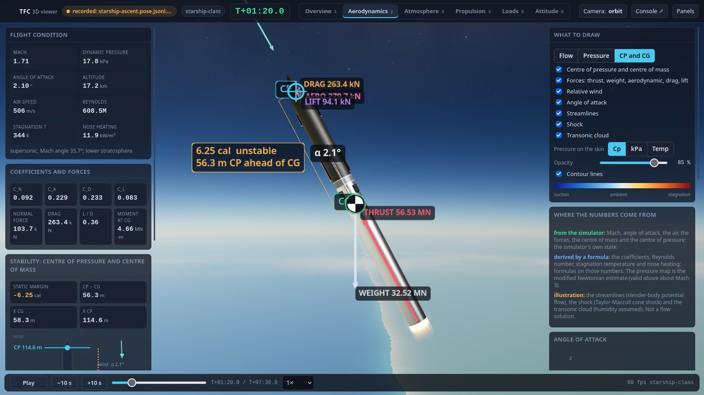
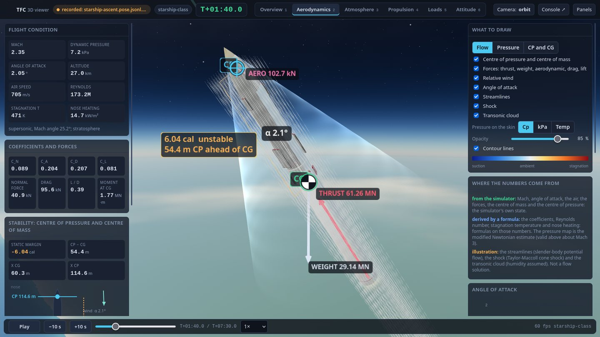
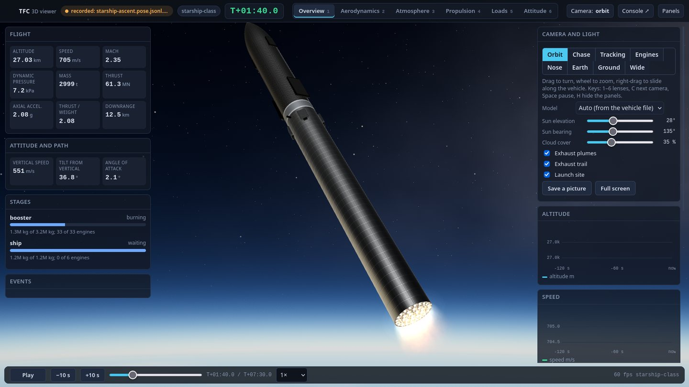
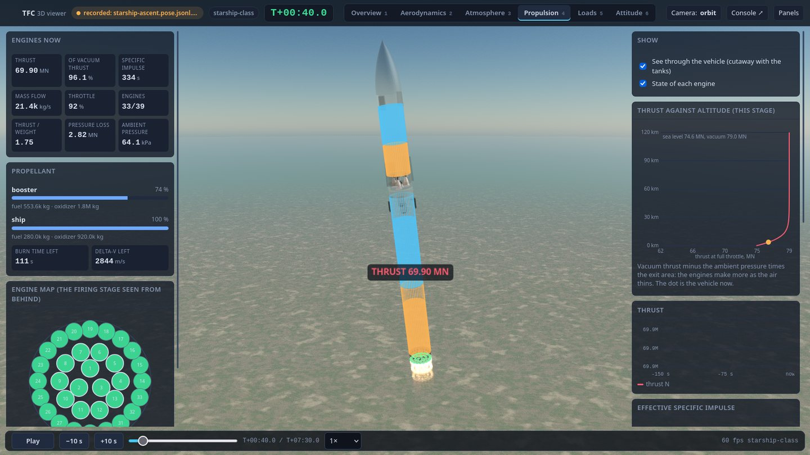

# The 3D viewer: the flight seen as a vehicle, not as numbers

> Status: **built** (ADR-035, 9 Oct 2026): `console/web/viewer/` (the page: WebGL through three.js, vendored), `console/tfc_console/viewer.py` (the data path), `sim/vehicle/viewer_state.hpp` (what the simulator sends), `tfc_simd --viewer`, `tfc_fly --pose`, and a vehicle of the Starship class, `vehicles/starship.json`. Tested on the host (C++: 10 tests, a flight of the vehicle through hot staging and 14 mutants; Python: 39 tests) and **live against the real firmware** (three flight-computer processes, ACT and the simulator on `vcan0`: 50 poses a second, 59 frames a second in the browser). The pictures were looked at in a real browser on a real GPU, which is the only check a picture has; **nothing here has run on a board**, and the GPU cost has been measured on one machine only (section 12).





## 1. What it is, and what it is not

The console ([`CONSOLE.md`](CONSOLE.md)) shows the system as numbers, charts and a SVG rocket. The viewer shows the **vehicle** the simulator is flying: in a sky, over a launch site, with its engines, its stages, its air and its forces, from any side, live or from a recording, in six **lenses** that each look at one process in more detail: *Overview*, *Aerodynamics* (with the centre of pressure and the centre of mass), *Atmosphere*, *Propulsion*, *Loads* and *Attitude*.

It is a **window, not a model**. It decides nothing, sends nothing to the flight bus, and computes nothing the simulator should have computed: every number in a pose is the simulator's own state or one of its own functions (the atmosphere, the wind, the aerodynamics). Where the viewer calculates (a coefficient, a bending moment) it is a formula on those numbers and the lens says so; where it *draws* something the simulator does not model (the air's flow, the exhaust, the ground) it is labelled an illustration. Section 6 is the full list, because the project's rule is that a number says where it came from.

## 2. Starting it

```bash
console/tfc-console                       # the usual: the page opens; "3D viewer" is printed under the address
#  http://127.0.0.1:8765/viewer/?token=...     the viewer, in a window of its own (a second monitor)
console/tfc-console --viewer console/demo/starship-ascent.pose.jsonl.gz   # a recorded flight of the Starship-class vehicle: no bus, no rig
build/host/tfc_fly vehicles/starship.json --sensors vehicle --no-accel --pad 300 --pose flight.pose.jsonl   # make your own
```

In the viewer, the chip at the top left says where the data comes from; click it to **open a recorded flight**, to **fly any vehicle in `vehicles/`** with the real flight software (it runs `tfc_fly` and plays the result: no flight computer process, a software run of the flight function). To see the **real flight computers** fly a vehicle, choose it on the Launch tab (*Vehicle on the rig*): the console builds the three computers with that vehicle's tables (about half a minute), the rig starts, and the viewer follows the launch live (ADR-036, `CONSOLE.md` section 8), or to see where a live simulator sends. Keys: `1`–`6` the lenses, `C` the next camera, `Space` play and pause, `H` hide the panels, `F` full screen, `P` a picture.

With the rig running (**Rig** tab of the console, *Closed loop with the launch sequence*), the console starts `tfc_simd` with `--viewer PORT` itself and the viewer shows the launch as it happens.

## 3. Why a page of its own, on the same server

The question was whether the viewer should share the console's page or be a different local server. **A separate page on the same server, in its own browser window.** The cost of a 3D view is the browser's main thread and the GPU, not the server's: a separate window is a separate browser process, so the console's charts and the viewer's frames do not take turns, and the rig (five processes with 10 ms deadlines, which a loaded host disturbs) is not asked for more than a pose stream a page may or may not listen to. A second *server* process would have to receive the same UDP telemetry (the port can be bound once), keep a second copy of the state and the token, and be one more thing to start; it would buy nothing the window does not. The viewer has its own event stream (`/api/pose-stream`): a console with no viewer open pays nothing for it (a pose is parsed and kept as the latest, and dropped).

```
 tfc_simd --viewer PORT  --UDP 50 Hz-->  PoseSource  --> ViewerHub --SSE /api/pose-stream--> viewer page (WebGL)
 tfc_fly --pose FILE   --file-->  PoseReplay (play, pause, seek, speed) -->   ^                  |
 a console recording (sidecar k:pose) --> LogSource (the bus replay) --------+                    +-- also /api/stream: the console's own state (nodes, ACT, mission clock)
```

## 4. What the simulator sends

`sim/vehicle/viewer_state.hpp` writes two kinds of one-line JSON; `tfc_simd --viewer PORT [--viewer-hz N]` sends them as UDP datagrams (a **pose** 50 times a second, the **spec** once at the start and every two seconds, because a datagram nobody listened to is lost); `tfc_fly --pose FILE [--pose-hz N]` writes them to a file (spec first). Both are output only: nothing the flight depends on reads them.

**The spec** (`k: spec`): the vehicle as the simulator reads it (the same normalised JSON `tfc_fly --dump` writes: stages, tanks, the engines with the rings expanded, so that an index in a pose is an index in this list, payloads, fins, the scenario), the planet's radius, mu, rotation and pole, and the **air by altitude** every kilometre to 120 km as the model gives it (temperature, pressure, density, speed of sound, mean wind): the viewer draws the atmosphere the vehicle flew through, dispersions included.

**A pose** (`k: pose`), in the inertial frame (+X up at the launch point at T-zero, +Y downrange, +Z crossrange; the body frame has +X along the axis to the nose):

| Key | Meaning | Source |
|---|---|---|
| `t`, `tt`, `fr` | flight time (negative on the pad), the vehicle's own time, the frame | the runner |
| `r`, `v`, `q`, `w` | position (m, from the planet's centre), velocity, attitude (w, x, y, z: body to inertial), body rates (rad/s) | `Vehicle6::state()` |
| `alt`, `rng`, `spd`, `mach`, `qd`, `alpha` | altitude, arc downrange, speed, Mach, dynamic pressure, total angle of attack (deg) | `Vehicle6`, `Loads` |
| `vair`, `wind`, `air` | velocity through the air in the body frame, the wind (inertial), [T, p, rho, a] here | `wind_at`, `atmosphere` |
| `m`, `cg`, `cp`, `cna`, `ca`, `dref` | mass, centre of mass and centre of pressure (m from the tail), the normal-force slope, the axial coefficient, the reference diameter | `mass_props`, `aero_summary` |
| `fth`, `fae`, `mth`, `mae`, `thr`, `mdot` | thrust and aerodynamic force and moment about the CG (body frame), total thrust, mass flow | `Loads` |
| `eng`, `gim`, `fin` | thrust fraction of each engine (-1: failed), gimbal pitch and yaw of each stage, fin deflections | `engine_fraction`, `stage_gimbal_*`, `fin_*` |
| `prop`, `tank` | propellant per stage and the liquid in each tank (kg) | `propellant`, `tank_liquid_kg` |
| `stg`, `ign`, `pay`, `gnd`, `clamp`, `crash` | bits of the stages on, ignited, payloads on; on the ground, clamped, destroyed | the model |
| `tilt`, `ref`, `cmd`, `act` | the two tilts, the program's tilts, ACT's command, ACT's mode | `tilts`, the flight tables, the runner |
| `slosh`, `flex` | slosh displacements and the bending mode, when the vehicle has them | the state |

The C++ tests (`tests/test_viewer_state.cpp`) hold the pose to the vehicle: the position is a planet radius plus the altitude, the quaternion is a unit one in (w, x, y, z) order, the air velocity has the wind taken out, the tanks add up to their stage's propellant, the gimbals are the stages' (pitch then yaw), a failed engine is -1, a separated stage's tanks read empty and its engines read off, and the first line is the spec of the vehicle it describes. Fourteen mutants of the export and of the accessors it uses (`tools/mutation/sim_mutations.py`) are killed.

## 5. Frames, time, and the two scenes

**Axes.** The scene's are Y up, X right, Z toward the viewer; the simulator's are X up, Y downrange, Z crossrange. The map is the cyclic permutation `scene = (sim.Z, sim.X, sim.Y)` (determinant +1, no mirror image), applied to vectors and to the vector part of quaternions, and to the vehicle's body axes (the model's Y is the vehicle's axis).

**Time.** The page keeps a clock that advances in real time at the source's speed and is pulled gently to just behind the newest pose (0.1 s); poses between are interpolated (a cubic through both positions and velocities, a slerp for the attitude, a line for the rest), so a late datagram never shows as a jump. A seek in a recording resets the page and shows the pose it landed on.

**Two scenes, because the numbers do not fit in one.** A planet is 6,371 km across and a vehicle is 9 m. In one scene with one depth buffer, 32-bit floats cannot put a bolt and a horizon in the same frame. So the sky, the atmosphere and the planet are one fragment shader that works from the camera's place above the planet's centre (in kilometres), and everything near is drawn after it, in a scene whose origin is the vehicle's centre of gravity, in metres, with a depth buffer of its own: what is within a kilometre of the camera has millimetre precision (the transforms are done in JavaScript's doubles and only the small offsets reach the GPU).

**The sky** is single scattering by Rayleigh and Mie particles with exponential density (scale heights 8 and 1.2 km): the blue sky, the red sunset, the white glow round the sun and the thin bright limb seen from orbit come out of it, and its thickness follows the simulator's planet. The planet's surface is **procedural** (a coast at the launch point, the sea downrange, land behind, drifting clouds, ice, lights on the night side): it is not a map of anywhere, because the viewer has no imagery to use offline. The vehicle is lit by the sun (its colour is the atmosphere's transmittance along the sun's path) and by the sky itself, which is rendered into a small cube at the vehicle's place a few times a second and filtered for its reflections and ambient light, so a steel tank reflects the real sky, the real ground or the black of space.

## 6. What is measured, derived and illustrative

| Lens | Measured (the simulator's own) | Derived (a formula on it; the lens says which) | Illustrative (a picture, not a result) |
|---|---|---|---|
| **Overview** | altitude, speed, Mach, q, mass, thrust, the stages' propellant, the engines running, the events | acceleration in g, thrust-to-weight, vertical speed | the sky, the ground, the launch site and its tower, the exhaust trail, the pad's dust, a stage that has been let go (carried on by the viewer; the simulator does not track it) |
| **Aerodynamics** | Mach, angle of attack, the air, the forces and moments, the centre of mass, the centre of pressure | C_N, C_A, C_D, C_L, L/D, Reynolds number, stagnation temperature, Sutton-Graves nose heating (an assumed 0.5 m nose radius), the static margin | the pressure on the skin (modified Newtonian: Cp_max cos² of the angle to the wind, Cp_max from Rayleigh's pitot formula: a hypersonic method, qualitative below Mach 3), the streamlines (slender-body potential flow from the vehicle's own radius profile), the bow shock (the Taylor-Maccoll cone shock of the nose's angle, tilted with the angle of attack), the Prandtl-Glauert cloud (humidity assumed) |
| **Atmosphere** | pressure, density, temperature, speed of sound, the mean wind (the model's own, every km) | viscosity (Sutherland), mean free path, Knudsen number, scale height, the deviation from the 1976 standard | the shells in the sky and the colours of the bands |
| **Propulsion** | every engine's thrust fraction, the propellant in every tank, the mass flow, the gimbal | effective specific impulse, pressure loss, burn time left, delta-v left (Tsiolkovsky with the effective Isp) | the colour of the liquid, a tank drawn as a cylinder (the simulator's model of it), how far a plume spreads (the nozzle's exit pressure is not modelled: 70 kPa for a sea-level bell and 15 kPa for a vacuum one are assumed) |
| **Loads** | q, angle of attack, forces and moments, masses, where they are | the compression, shear and bending moment at 160 stations: a lumped-mass estimate (the mass spread along each stage and in each tank at its level, every piece accelerating as a rigid body, the aerodynamic normal force at the centre of pressure and the drag along the length): **not a structural analysis**, and there is no allowable | the curve drawn beside the vehicle |
| **Attitude** | the tilts, the rates, the program, the gimbals, ACT's command and mode, and (from the console) the nodes' health and ACT's vote | the error as an angle between two axes | the wire ghost of the vehicle at the program's attitude |

## 7. The vehicle's model

A vehicle is drawn from its **vehicle file** as the simulator read it: the diameters and the nose of every stage, the engines where the engine list puts them, the tanks. A generated model has three styles: *painted* (any vehicle), *Starship* and *plain*. **Starship** is a stainless 9 m stack: weld rings, a booster with its hot-stage ring and vents, four grid fins stowed against the skin and two catch pins, an engine skirt and a thrust plate; a ship with heat-shield tiles on the belly and the nose, two forward and two aft flaps stowed, and its engines (three sea-level, three vacuum, which have larger bells). Its proportions are the class's, public figures, not drawings, and **no markings are drawn**.

`vehicles/starship.json` is a vehicle for it to be: 33 + 6 Raptor-class engines (2.26 MN at sea level, 347 s; the vacuum engines 380 s), 3,200 t and 1,200 t of methane and oxygen, 275 t and 130 t of structure, a 100 t payload, hot staging, a pitch program that tips it over to 55° at staging. It is built from **publicly reported round numbers and is not SpaceX data**, not a model of any flight article, and nothing in the project's claims depends on it: it exists so that the simulator and the viewer have a vehicle of that class to fly. Flown with the real flight software it reaches Mach 1.1 and max-Q 30 kPa at T+57 s, stages at T+164 s at 70 km and 2.5 km/s, and burns out at about 7.8 km/s and 430 km. The flight computers' tables are the reference vehicle's, so the *rig* flies Starship only after `tfc_gen_tables --vehicle vehicles/starship.json` and a rebuild of the images; `tfc_fly` (and so the viewer's *Fly a vehicle*) designs the tables itself and needs neither.

**A CAD model of your own.** Put a glTF file (`.glb`) in `console/models/` and choose it under *Model* (`console/models/README.md`). The viewer asks which way the vehicle points in the file, scales it to the vehicle file's length by default and puts its tail at the origin, so that the engines, the centre of mass, the tanks and every overlay of the lenses (all of which come from the vehicle file and the simulator) are where the picture has them. Nodes named `stage1`, `stage2`… leave with their stage. The engines' bells of an imported picture are its own; the plumes and the gimbal are the vehicle file's.

## 8. Sources, and how a flight is kept

* **Live.** `tfc_simd --viewer PORT` (the rig the console starts gets it). The chip says *live simulator* and the bottom bar the pose rate.
* **A recording.** The console's recording (**REC**) writes `k: pose` and `k: spec` lines into the sidecar beside the bus log, so the bus replay plays the poses with the rest and a seek shows the viewer only where it ended (about 2.6 MB a minute, before gzip; the demo is kept compressed).
* **A pose file.** `tfc_fly VEHICLE --pose FILE` (`.pose.jsonl`, or `.gz`): `console/tfc-console --viewer FILE`, or the chip's menu. It has its own transport (play, pause, ±10 s, a scrubber, speed from 0.25× to 16×).
* **An older simulator or a recording made before the viewer existed** sends only the console's 10 Hz telemetry: the viewer then places and turns the vehicle (a generic one) and says so (*telemetry only*): there are no forces, no air and no per-engine state in it, and the lenses say what they miss.

## 9. True CFD, later

Nothing in the viewer solves the air, and every flow picture says so. When a CFD result exists (OpenFOAM or SU2 on the vehicle's own geometry) it replaces the illustrations without changing what the viewer is. The seams are three small ones: **the pressure on the skin** (`flow.js`, `CpSurface`: a per-vertex scalar for a case, today a function of the surface normal; a case would carry a Cp per vertex of the model's meshes, found by the Mach number and the angle of attack nearest the pose's, interpolated between cases), **the streamlines** (`Streamlines.build`, today an integration through an analytic field; a case would carry polylines, or a velocity field on a grid to integrate through) and **the shock** (a surface from a density-gradient iso-surface). A directory `console/cfd/NAME/` with a `manifest.json` (the vehicle, the Mach numbers and angles of attack the cases are for, the files) and a converter from VTK would be the whole interface; the viewer would interpolate between the nearest cases and show *CFD, case NAME* where it now shows *modified Newtonian*. The modelling cost is in the cases (a grid of Mach and angle of attack, for the stack with and without the booster, supersonic and transonic), not in the viewer.

## 10. Cameras

*Orbit* (drag to turn round the vehicle, wheel to zoom, right-drag to slide along it), *Chase*, *Tracking* (a camera on the ground by the pad that follows it up, with a field of view that keeps it the same size), *Engines* (on the vehicle, looking at the plumes), *Nose*, *Earth* (looking down at the planet it is leaving), *Ground* (a person by the pad: drag to look round) and *Wide* (a fixed point downrange). The lenses set a camera that suits them (the stability view is a side view of the whole vehicle).

## 11. The stage that has been let go

The simulator drops a stage when it separates: it does not track it. The viewer carries the picture of it on with the speed it had, pushes it back by the separation's delta-v, lets gravity and a simple drag act on it and turns it slowly, until it is under the ground or ten minutes old. That is a picture, not a result (a booster that flips back and lands is not drawn), and the Overview says so.

## 12. Cost, and what has not been measured

On the development machine (an NVIDIA GTX 1660 SUPER, Firefox 157, a 1600×900 window) the viewer holds 60 frames a second (the display's rate) with all six lenses; the sky pass is the cost (about 30 samples a pixel, a lower number in the cube that lights the vehicle). That is one machine: **no frame time has been measured on any other GPU**, and the *quality* setting that lowers the sky's samples and the resolution exists because a laptop will need it. The rig is sensitive to a loaded host; the viewer is a second browser process, and **starting a headless browser during a live rig run has cost a frame and a cascade of latches before** (`CONSOLE.md` section 8): open the viewer before a run, not during one.

There is no JavaScript engine on the bench, so the page's code is checked by three things that need none: every import of every module resolves to a file, the vendored library is the release the README names (SHA-256), no script is inline (the policy forbids it); and by looking at it. The page also has a smoke test of its own, as the console has (`?selftest=1&hold=30000`, in a headless Firefox): it goes through the six lenses, the eight cameras and the three model styles on the flight being shown and checks that nothing threw, that every lens drew its panels with numbers and no NaN, and that a camera has a finite eye (38 checks, all passing on 9 Oct 2026). A headless browser does not put a WebGL canvas into its screenshots, so the page has `?shot=N` (after N frames, the canvas is copied into an image over itself) and `?debug=1` (its console goes to the server's standard error); the recipe is in the project's notes.





## 13. What it does not claim

* It is a **bench and design tool**. Its sky is procedural, its Starship is the class's proportions, its flow is a picture.
* It does not know what the flight computers decided; it shows the state of the vehicle they steer and, with the rig, the console's own view of them.
* The Loads lens is not stress analysis: it has no allowables and no margins, because the project has none.
* **A mutant of the pictures does not exist**: what the viewer draws is checked by eye, by the tests of the data it draws from, and by a list of what each picture is (section 6).
